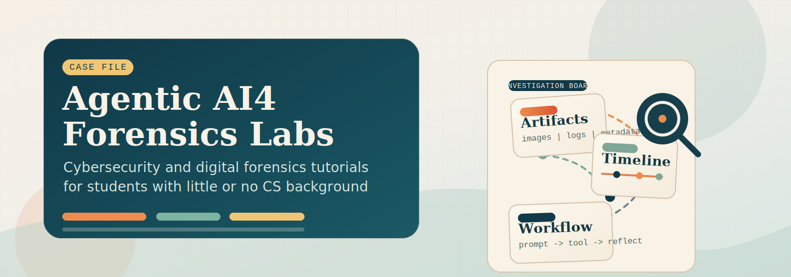

# Agentic AI4 Forensics Labs

<p align="center">
  
</p>

This repository contains a standalone set of student-facing labs for agentic AI patterns in digital forensics.
It is designed for cybersecurity and digital forensics students, including learners with little or no computer science background.

## Intended Audience

These tutorial labs are written for students who are learning cybersecurity or digital forensics and may be new to programming.
The onboarding sequence starts with a lightweight Python and LLM foundation so students can follow the later agent labs without needing a full computer science background.

## Code Provenance

The agent workflow code in `src/agentic_patterns/` gives credit to The Neural Maze's
[`agentic-patterns-course`](https://github.com/neural-maze/agentic-patterns-course), which provides the upstream course code foundation for several of the labs here.
Parts of that implementation are adapted and reused under the MIT License.

The original copyright and permission notice are preserved in
[`THIRD_PARTY_NOTICES.md`](THIRD_PARTY_NOTICES.md).

## Get The Repo

Clone the repository to your local machine, then move into the project folder.

```bash
git clone https://github.com/frankwxu/agentic-AI4-forensics.git
cd agentic-AI4-forensics
```

## Quick Start

Most runnable lab folders now have their own `.env.example`. Lab 0-00 (`lab0_00_python_basics`) begins the course with a lightweight Python primer for reading notebook code. Lab 0-01 (`lab0_01_llm_foundations`) covers the basic local Python setup needed for the tiny LLM notebook. Lab 0-02 (`lab0_02_environment_setup`) adds `.env`, Ollama, and Graphviz for the agent workflow labs.

The onboarding labs are paced for cybersecurity and digital forensics students who may only have a little programming experience.

Before running a notebook in one of the later hands-on labs, copy that lab's `.env.example` to `.env` inside the same folder. For example:

```bash
cp lab0_02_environment_setup/.env.example lab0_02_environment_setup/.env
```

On Windows, create `.env` by copying the matching lab-local `.env.example`.

Then update that lab-local `.env` with the `MODEL` and `OLLAMA_BASE_URL` values provided by your instructor.

Repeat that pattern for any lab you plan to run. For example:

```bash
cp lab2_tool_use_pattern/.env.example lab2_tool_use_pattern/.env
```

Lab 2 defaults to `qwen3:8b` in its local example because the `ToolAgent` section has been more stable with that model in the current Ollama setup.

Begin with [lab0_00_python_basics/01_instructions.md](lab0_00_python_basics/01_instructions.md). Then continue to [lab0_01_llm_foundations/01_instructions.md](lab0_01_llm_foundations/01_instructions.md), followed by [lab0_02_environment_setup/01_instructions.md](lab0_02_environment_setup/01_instructions.md). The onboarding sequence now has five parts:

- `Lab 0-00` (`lab0_00_python_basics`): Python primer for reading course notebooks, with a short reading and two small practice notebooks
- `Lab 0-01` (`lab0_01_llm_foundations`): LLM foundations primer with repo clone, base Python setup, and a tiny local training demo
- `Lab 0-02` (`lab0_02_environment_setup`): `.env`, Ollama, Graphviz, and environment checks for the later agent labs
- `Lab 0-03` (`lab0_03_model_warmup`): a small model-comparison exercise
- `Lab 0-04` (`lab0_04_what_is_an_agent`): a hands-on introduction to agent workflows

Each onboarding lab has its own `01_instructions.md` with the step-by-step details.

## Lab Folders

- `lab0_00_python_basics/`: Python primer with a short reading, two small guided notebooks, and tiny JSON/CSV practice data
- `lab0_01_llm_foundations/`: LLM foundations primer with base local setup, a tiny local training demo, reading, figures, and a short public-domain book excerpt
- `lab0_02_environment_setup/`: Setup lab for `.env`, Ollama, Graphviz, and connectivity verification for the later workflow labs
- `lab0_03_model_warmup/`: Warm-up lab for comparing outputs from multiple models and revising prompts for consistency
- `lab0_04_what_is_an_agent/`: Warm-up lab for comparing a plain model prompt with a bounded agent workflow and designing a small agent card
- `lab1_reflection_pattern/`: Reflection lab for suspected customer-data exfiltration
- `lab2_tool_use_pattern/`: Tool-use lab for image metadata, vehicle matching, and sale-draft review
- `lab3_react_pattern/`: ReAct lab for step-by-step communication verification with tool calls
- `lab4_planning_pattern/`: Planning lab for phone access, call timing, and delayed WhatsApp delivery
- `lab5_multiagent_pattern/`: Multiagent lab for transmission assessment and chain-of-custody review

## Investigation Cases And Pattern Fit

- `Lab 1 Reflection Pattern`: Students investigate suspected customer-data exfiltration in a business setting. The reflection pattern helps them critique an initial answer, notice missing evidence or weak reasoning, and improve the investigative write-up.
- `Lab 2 Tool Use Pattern`: Students work through image metadata, vehicle matching, and sale-draft evidence. The tool-use pattern shows how an agent can call specific tools to inspect artifacts instead of guessing from the prompt alone.
- `Lab 3 ReAct Pattern`: Students verify communications through step-by-step reasoning with tool calls. The ReAct pattern helps them alternate between thinking and evidence collection during the investigation.
- `Lab 4 Planning Pattern`: Students examine phone access, call timing, and delayed WhatsApp delivery. The planning pattern helps break a more complex forensic question into smaller investigative steps that can be checked in sequence.
- `Lab 5 Multiagent Pattern`: Students assess transmission activity and review chain-of-custody issues across the case record. The multiagent pattern shows how different investigative roles can split the work, compare findings, and combine them into a final assessment.

Each onboarding lab folder includes its own instructions and supporting materials for that part of the setup or warm-up sequence.

Labs 1 through 5 contain:

- `01_instructions.md` with the lab workflow and requirements
- `02_case_overview.md` with the incident background and case context
- one or more `03*.ipynb` notebooks with the interactive walkthroughs for the lab
- `.env.example` with lab-local model settings
- a `data/` subfolder with the staged case artifacts
- a `figures/` subfolder when the lab includes workflow diagrams

Each `data/` folder includes the synthetic evidence artifacts, including an artifact manifest, a chain-of-custody log, and lab-specific files for analysis.

Students should follow this sequence:

1. `lab0_00_python_basics`
2. `lab0_01_llm_foundations`
3. `lab0_02_environment_setup`
4. `lab0_03_model_warmup`
5. `lab0_04_what_is_an_agent`
6. `lab1_reflection_pattern`
7. `lab2_tool_use_pattern`
8. `lab3_react_pattern`
9. `lab4_planning_pattern`
10. `lab5_multiagent_pattern`
