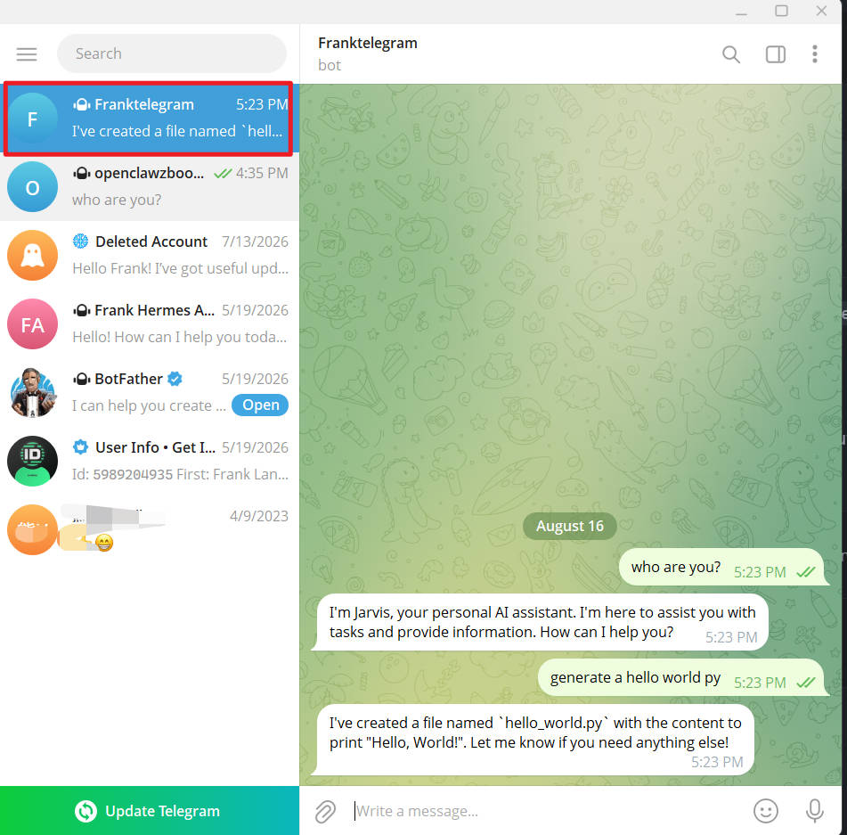
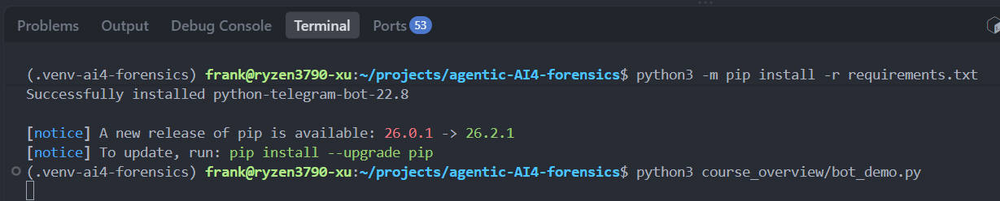
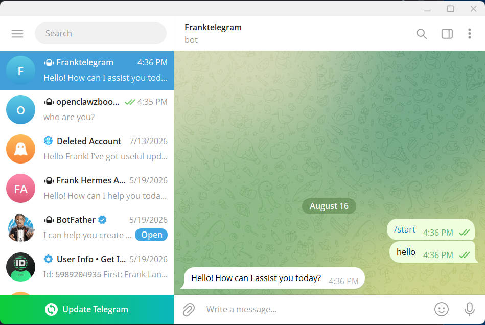

# Bot Demo: Memory and Tools

`telegram_agent_demo.py` is a Telegram-based AI agent classroom demo. It shows three agent capabilities:

- **Memory:** each Telegram user's conversation is stored in a separate JSONL file and reused on their next message.
- **Tool use:** the model can request shell commands, file reads, file writes, and a placeholder web search.
- **Agent loop:** the bot sends tool results back to the model until it produces a final reply.

For a step-by-step companion tutorial, see [Build an autonomous AI agent with OpenAI and Telegram](https://gist.github.com/dabit3/bc60d3bea0b02927995cd9bf53c3db32).

## How the agent works

Each Telegram user has an independent conversation memory file, stored as `course_overview/sessions/<telegram-user-id>.jsonl`. A JSONL file has one JSON message per line, making it easy to inspect or delete when resetting a demo.

When a user sends a message, the bot follows this sequence:

1. Load that user's saved messages and append the new Telegram message.
2. Send the personality prompt, conversation history, and tool definitions to the model.
3. The model decides whether to reply normally or request a tool. `tool_choice="auto"` means the model chooses based on the tool names, descriptions, and the user's request.
4. When the model requests a tool, Python runs it, adds the result to the conversation as a `tool` message, and asks the model again. This repeats until the model returns a normal text answer.
5. Save the updated conversation and reply to the user in Telegram.

For example, a request such as “read this file” may cause the model to choose `read_file`; a casual question usually produces a direct text answer without any tool call. The model can request only the tools listed in `TOOLS`, although this classroom example intentionally gives those tools broad local access.

### Example conversation

This conversation illustrates the agent receiving messages and replying through Telegram:



## 1. Install dependencies

From the repository root:

```bash
python3 -m pip install -r requirements.txt
```

## 2. Configure environment variables

Use [`.env_example`](.env_example) as the template for the credentials file. Keep the real `.env` in the separate secure folder used by this course, not in this repository.

By default, the script loads `/home/frank/projects/telegram_bot/.env`; if that file is unavailable, it falls back to a `.env` in the current working directory. Add these values to the secure `.env` file:

```dotenv
TELEGRAM_BOT_TOKEN=your_telegram_bot_token
OPENAI_API_KEY=your_openai_api_key
OPENAI_MODEL=your_model_name
```

The template also includes `TELEGRAM_CHAT_ID`. The current demo does not use it because it replies directly to whichever chat sent the message, but it can be retained for a future chat allowlist or proactive-message feature.

For example, `OPENAI_MODEL` may be a tool-capable chat model available to your OpenAI account. Never commit the real `.env`; it contains credentials.

## 3. Start the bot

Run this command from the repository root:

```bash
python3 course_overview/telegram_agent_demo.py
```

The terminal should show the dependency installation completing, followed by the bot process waiting for Telegram messages:



Open Telegram, find the bot associated with `TELEGRAM_BOT_TOKEN`, and send it a normal text message. The demo ignores Telegram commands such as `/start`.

Stop polling with `Ctrl+C`.

### Expected Telegram interaction

After sending a message, the bot responds in the Telegram chat:



## What to demonstrate

1. Send a message such as `My favorite color is green.`
2. Send a second message: `What color did I tell you I like?`
3. Ask the bot to inspect a harmless local file or run a harmless command, such as `pwd`.
4. Explain that each tool request is printed in the terminal and that the result is returned to the model before it answers.

Memory files are written beside the script in `course_overview/sessions/<telegram-user-id>.jsonl`, regardless of the directory from which the command is run. Remove a user's file to reset that user's conversation memory.

## Tools in this demo

| Tool | Behavior |
| --- | --- |
| `run_command` | Runs a shell command; relative files made by the command are created in `course_overview`. |
| `read_file` | Reads a UTF-8 text file. |
| `write_file` | Writes a UTF-8 text file inside `course_overview`; paths outside that folder are rejected. |
| `web_search` | Returns a placeholder result; it does not perform a real web search. |

## Classroom safety

This is intentionally permissive demonstration code. A person who can message the bot may prompt it to run commands and read or write files accessible to the account running it. Use a dedicated bot token, run it only in a controlled classroom setting, and stop it after the demonstration. Do not deploy it publicly or run it with sensitive files or elevated permissions.
