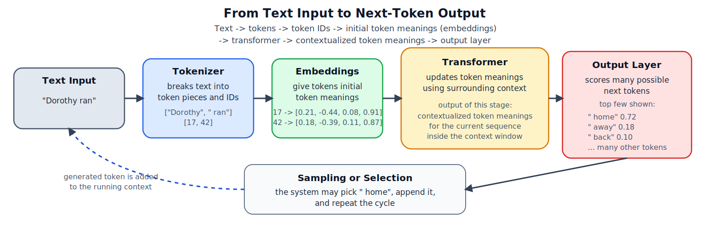
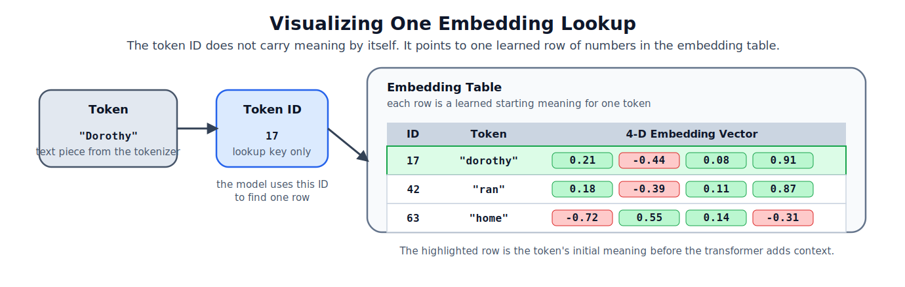
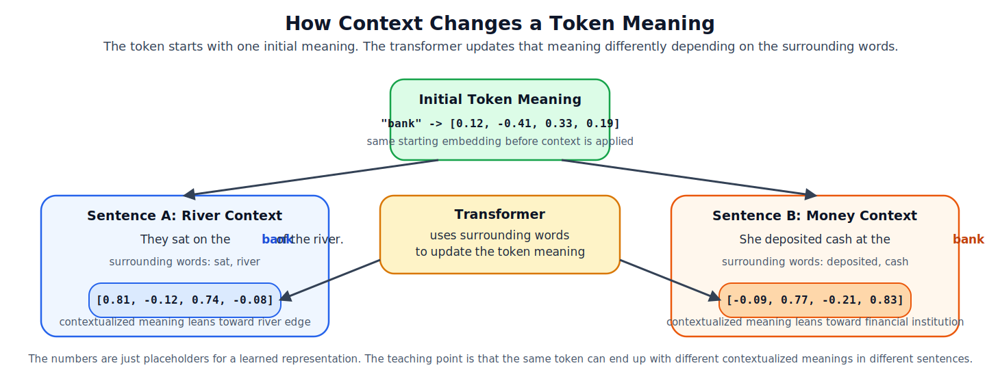
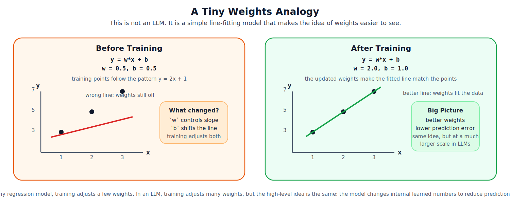
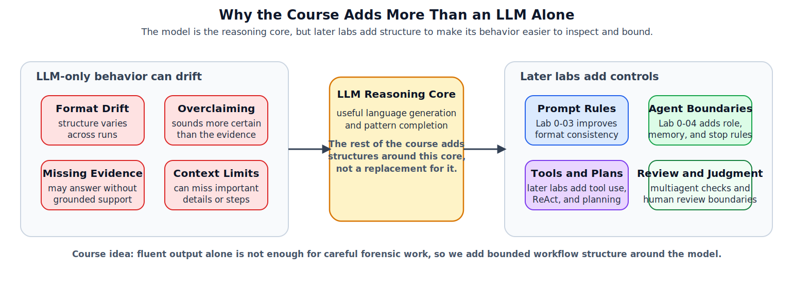

# Lab 0-01 Reading: What Is an LLM?

This reading gives you a teaching-friendly picture of what a large language model is and what it is not. The goal is not to cover every detail of modern AI systems. The goal is to help you build a usable mental model before you start the setup, prompt, and agent labs.

This lab also includes a runnable notebook, [03_tiny_llm_book_demo.ipynb](03_tiny_llm_book_demo.ipynb), where you will train a tiny word-level transformer on a short public-domain book excerpt and inspect its next-word predictions.



*Figure 1. A teaching-friendly LLM pipeline: text becomes tokens, tokens become token IDs, token IDs become initial token meanings (embeddings), the transformer turns those into contextualized token meanings, and the output layer scores many possible next tokens. The figure shows only the top few probabilities so they are easy to read.*

## 1. What Is an LLM?

An `LLM`, or large language model, is a system trained to predict the next token in a sequence of text.

That definition sounds simple, but it is the key idea behind many modern chat systems. When you ask a question, the model does not look up a hidden answer sheet in the way a database would. Instead, it uses patterns learned from training data to decide which token is most likely to come next, then repeats that step again and again.

In plain language, an LLM is:

- a model that reads text as tokens
- a model that uses prior context to predict what should come next
- a model that can generate useful language without truly "understanding" text the way a person does

This is why an LLM can produce responses that sound fluent, organized, and confident, even when parts of the answer are incomplete or wrong.

## 2. How Text Becomes Tokens

Models do not read raw text the way humans do. They first break text into smaller pieces called `tokens`.

Depending on the tokenizer, a token might be:

- a whole short word
- part of a longer word
- punctuation
- whitespace patterns
- a symbol or number chunk

For example, the sentence:

```text
Dorothy ran home.
```

might be broken into pieces like:

```text
["Dorothy", " ran", " home", "."]
```

The exact split depends on the tokenizer. The important point is that models work with token sequences, not with human-friendly word boundaries.

### What This Looks Like

You can picture tokenization as a first pass that turns text into chunks the model can work with, and then assigns each chunk an ID.

For example:

```text
Original text:
Dorothy ran home.

Possible token sequence:
["Dorothy", " ran", " home", "."]

Possible token IDs:
[17, 42, 9, 3]
```

The model does not yet know what these chunks mean. At this stage, it has an ordered sequence of pieces and a numeric ID for each piece.

In the tiny notebook for this lab, we simplify even further and use `word-level tokens`, so each word is treated as one token. Real production LLMs often use more flexible tokenizers that can split longer words into smaller parts.

### Why This Matters

- A single word can become multiple tokens.
- A prompt with more tokens uses more of the model's context window.
- Small wording changes can change the token sequence and therefore change the output.

## 3. From Token IDs to Initial Token Meanings

Token IDs are only labels. Before the model can do useful math with them, it looks up each ID in an embedding table and turns it into a small vector of learned numbers.

That is the role of `embeddings`: they give each token an initial meaning the model can work with numerically.

### What This Looks Like

Students often ask what an embedding actually is. A simple answer is: it is a row of learned numbers attached to a token.

For example, a tiny teaching model might store something like:

```text
"dorothy" -> token ID 17 -> [0.21, -0.44, 0.08, 0.91]
"ran"     -> token ID 42 -> [0.18, -0.39, 0.11, 0.87]
"home"    -> token ID 63 -> [-0.72, 0.55, 0.14, -0.31]
```



*Figure 2. A token does not carry meaning as raw text or as an ID alone. The model uses the token ID to look up one learned row of numbers in the embedding table, giving that token an initial meaning before context is applied.*

Those numbers are not meant for people to read directly. They are values the model learns so it can process tokens mathematically.

One helpful mental model is:

- tokenization gives the model token pieces
- token IDs give each token a lookup key
- embeddings give each token a learned numeric row from a table

So when students ask, "What does an embedding look like?", the shortest correct answer is:

`a small vector of learned numbers attached to a token`

You do not need to interpret each number by itself. What matters is that the model uses those numbers as the token's starting meaning before context is applied.

## 4. What a Transformer Does at a High Level

The `transformer` is the model architecture that made modern LLMs practical at scale.

For this course, treat the transformer as a black box with a clear job:

- input: the tokens seen so far, represented as embeddings
- internal work: update those token meanings in relation to one another inside the allowed context window
- output: contextualized token meanings that can be used to score the next token

One helpful way to think about the internal pieces is:

- `tokenizer`: turns text into token IDs
- `embeddings`: give each token an initial meaning
- `transformer blocks`: update token meanings using surrounding context
- `output layer`: converts the current contextualized state into next-token scores
- `sampler`: selects the next token from those scores

This is why the wording `contextualized token meanings` can be helpful. Before the transformer, each token has a starting embedding. After the transformer, that representation has been updated using the nearby words.

### What This Looks Like

The same token can end up with different contextualized meanings in different sentences.

Up to this point, the reading has used `Dorothy ran ...` as the main running example. Here we briefly switch to `bank` because it is a better word for showing contextualization: the same token can point toward different meanings depending on the surrounding words.

For example, consider the token `bank`:



*Figure 3. This is a second teaching example used only to show contextualization. The token `bank` can start with one initial embedding, but the transformer updates it differently in a river sentence versus a money sentence. That is what we mean by a contextualized token meaning.*

### What a Context Window Means

The `context window` is the amount of recent text the model is allowed to consider at one time when predicting the next token.

For example, if a tiny model could only look at the last 6 tokens, then:

```text
... Aunt Em called, and Dorothy ran home
```

the model might only "see" something like:

```text
["Em", "called", ",", "Dorothy", "ran", "home"]
```

Anything earlier than that would fall outside the current window.

That is why longer prompts can matter. More useful recent context often leads to better next-token predictions.

You do not need the math for this course. What matters is that the model is constantly turning initial token meanings into contextualized token meanings before making a prediction.

## 5. What the Model Predicts

At each generation step, the model takes the current contextualized token meanings and produces a probability distribution over possible next tokens.

To keep one running example, the next few sections continue with the same tiny sentence.

For example, after the text:

```text
Dorothy ran
```

the model might internally lean toward possibilities such as:

- ` home`
- ` away`
- ` back`

The model does not simply "know" one correct next token. It scores many possibilities and the system then selects or samples one.

The output layer scores the whole vocabulary, but Figure 1 shows only a small top-token slice so the probabilities are easy to read.

This is the core loop:

1. read the current token sequence
2. turn token IDs into embeddings
3. use the transformer to update those meanings with context
4. score possible next tokens
5. choose one token
6. append it to the sequence
7. repeat

That is what people mean by `next-token prediction`.

### What This Looks Like

Suppose the current text is:

```text
Dorothy ran
```

The model may score possible next tokens something like this:

```text
" home"      0.72
" away"      0.18
" back"      0.07
other tokens 0.03 combined
```

That does not mean the model has proven Dorothy ran home. It means that, given the words so far, `home` currently looks like the most likely next token.

## 6. Training Versus Using a Model

Students often blur `training` and `inference`, so keep them separate:

- `training`: the model's internal weights are updated so it gets better at prediction
- `inference`: the model uses its current weights to generate an output, but the weights do not change

`Weights` are the internal learned numbers of the model. During training, the model adjusts those numbers a little at a time so its predictions get better.

During training, the model repeatedly predicts tokens, compares its predictions with the training text, measures error, and updates its weights to reduce that error over time.

During inference, the model does not learn from your single prompt in the normal sense. It is only using what it already learned plus the context you provided in the current input.

This distinction matters later in the course:

- prompt engineering changes the input context during inference
- it does not retrain the model
- agent workflows add structure and tools around inference
- they do not magically remove model limitations

### A Tiny Analogy for Weights

If the word `weights` still feels abstract, it can help to look at a much simpler model first.



*Figure 4. This is not an LLM. It is a small line-fitting example used only to show what a weight is. Training changes the model's internal numbers so its predictions move closer to the data.*

### What One Training Example Looks Like

Here is a tiny teaching example:

```text
Input context:   "Dorothy ran"
Target next word: "home"
```

The model makes a prediction such as:

```text
"home"  0.72
"away"  0.18
"back"  0.07
```

If the correct next word is `home`, the model is mostly right but still imperfect. Training uses that error signal to adjust the model's weights a little bit.

After many examples, the model becomes better at predicting likely next tokens from similar contexts.

This is why training and inference feel different:

- training changes the model
- inference uses the current model

## 7. Why Prompting Changes Outputs

Prompts matter because prompts are part of the token context.

If you ask:

```text
Continue the sentence:
Dorothy ran
```

you give the model a broad context with few boundaries.

If you ask:

```text
Continue the sentence with exactly one word:
Dorothy ran
```

you change the token context and make some next-token paths more likely than others.

This is why prompt wording can influence:

- format
- level of detail
- caution or certainty
- consistency across runs

### Temperature

`Temperature` changes how deterministic or variable token selection becomes.

If the model scores three next tokens with similar probabilities, then:

- lower temperature makes the output more conservative and predictable
- higher temperature makes the output more varied and more surprising

In simple terms:

- low temperature: "pick safer high-probability tokens"
- high temperature: "allow lower-probability tokens more often"

That is one reason the same prompt can produce different outputs across runs or settings.

### What This Looks Like

Suppose the next-token probabilities are:

```text
"home"  0.72
"away"  0.18
"back"  0.10
```

At lower temperature, the system is more likely to keep choosing `home`.

At higher temperature, `away` or `back` become more likely to appear, even though they started with lower scores.

## 8. Why LLM Limits Matter for Forensics and Agents

In digital forensics, fluent text is not enough. The answer also has to stay bounded by evidence.

An LLM-only workflow can run into problems such as:

- inventing details that were not in the evidence
- overstating certainty
- drifting away from the required output format
- missing key context when the prompt is too broad
- sounding persuasive even when the underlying reasoning is weak

These are not bugs in only one model. They are reasons the later labs add structure around the model.



*Figure 5. LLM-only behavior is useful but not always reliable enough for bounded forensic tasks. The rest of the course adds prompt rules, tools, memory, planning, multiagent review, and human judgment around the model.*

This course responds to those limits in stages:

- `lab0_03_model_warmup`: show that prompt wording and model choice change outputs
- `lab0_04_what_is_an_agent`: show how the same model behaves differently inside a bounded workflow
- `lab1` through `lab5`: add reflection, tools, step-by-step reasoning, planning, and multiagent review

The big course idea is not that an LLM becomes perfect once you wrap it in a workflow. The idea is that well-designed structure makes the model's behavior easier to inspect, constrain, and review.

## 9. Short Reflection Questions

Use these questions to check your understanding:

1. In one or two sentences, what does an LLM predict at each generation step?
2. Why is a token not always the same thing as a word?
3. What is the difference between training a model and using a model at inference time?
4. Why can two prompts about the same topic produce different answers?
5. Why can an LLM sound confident and still be wrong?
6. Name one reason later labs add tools, memory, or human review around the model.

## Notebook Bridge

When you open [03_tiny_llm_book_demo.ipynb](03_tiny_llm_book_demo.ipynb), watch for these connections:

- the corpus text becomes a sequence of word-level tokens
- token IDs are turned into initial token meanings through embeddings
- the transformer updates those into contextualized token meanings
- training lowers loss by improving next-word predictions on that small corpus
- inference uses the trained model to score and sample likely next words
- the model can still sound fluent while remaining limited by its size, data, and context

## One Last Bridge to the Next Labs

If you remember only three things from this primer, keep these:

- an LLM works by predicting the next token from context
- prompt wording changes that context and therefore changes output behavior
- later labs add structure because language fluency alone is not enough for careful forensic work

When you are ready, move on to [lab0_02_environment_setup/01_instructions.md](../lab0_02_environment_setup/01_instructions.md).
