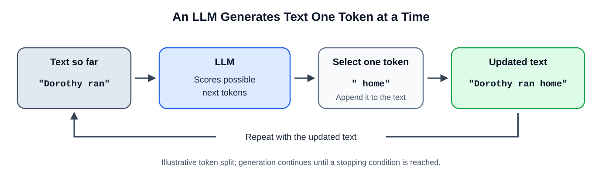
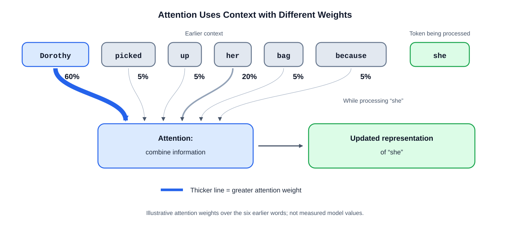
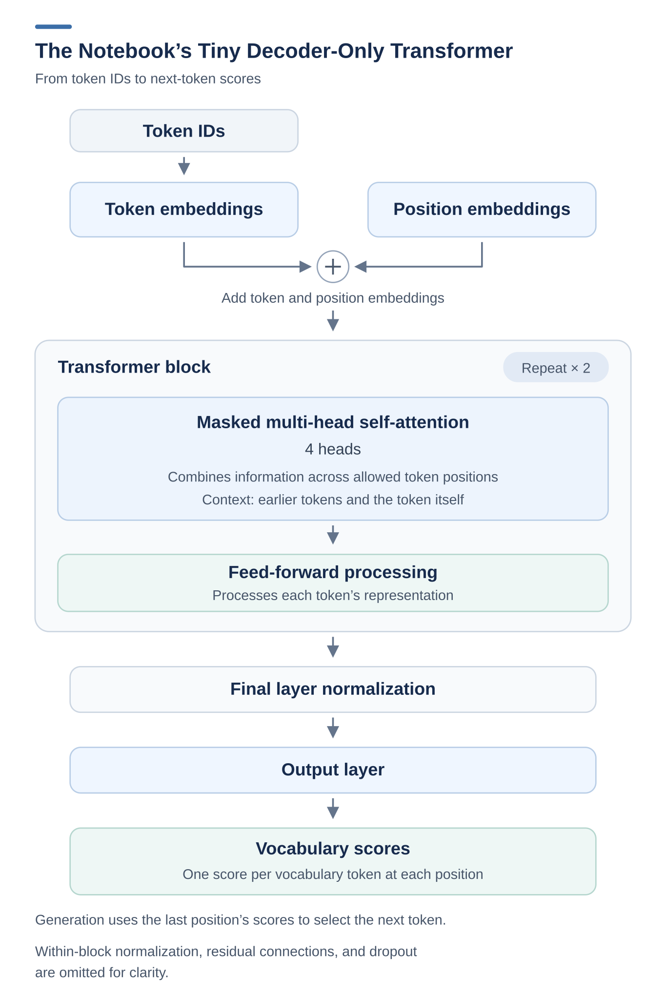

# Lab 0-01 Reading: What Is an LLM?

This reading gives you a teaching-friendly picture of what a large language model is and what it is not. The goal is not to cover every detail of modern AI systems. The goal is to help you build a usable mental model before you start the setup, prompt, and agent labs.

This lab also includes a runnable notebook, [03_tiny_llm_book_demo.ipynb](03_tiny_llm_book_demo.ipynb), where you will train a tiny word-level transformer on a short public-domain book excerpt and inspect its next-word predictions.

## 1. What Is an LLM?

An `LLM`, or large language model, is a type of AI model that excels at understanding and generating human language. It is trained on large amounts of text to recognize language patterns and can interpret the wording and context of an input well enough to produce a useful response. This capability does not prove human-like comprehension or guarantee that its response is factually correct or supported by evidence.

Under the hood, the central job is simpler: predict the next token from the text that came before it. When you ask a question, the model does not look up a hidden answer sheet in the way a database would. Instead, it uses patterns learned from training data to score possible next tokens, selects one, and repeats that step again and again.

Figure 1 shows this loop: the selected token is added to the text before the next prediction.



*Figure 1. An LLM generates text one token at a time. Each selected token becomes part of the context for the next prediction. A plausible continuation is not necessarily a verified fact.*

In plain language, an LLM is:

- a model that reads text as tokens
- a model that uses prior context to predict what should come next
- a model that can generate useful language without guaranteeing human-like understanding, factual correctness, or evidence-based conclusions

This is why an LLM can produce responses that sound fluent, organized, and confident, even when parts of the answer are incomplete or wrong.

**Examples of LLMs.**

The following are representative LLM families and their providers:

| Model | Provider |
| --- | --- |
| ChatGPT (GPT family) | OpenAI |
| GPT4 | OpenAI |
| Claude | Anthropic |
| Gemini | Google |
| Llama 3 | Meta (Facebook AI Research) |
| Qwen | Alibaba Cloud |
| DeepSeek-R1 | DeepSeek |
| SmolLM2 | Hugging Face |
| Gemma | Google |
| Mistral | Mistral |

For a second, approachable explanation, see Hugging Face's [What are LLMs?](https://huggingface.co/learn/agents-course/en/unit1/what-are-llms) lesson.

For a video introduction, watch [What Is a Large Language Model (LLM)?](https://www.youtube.com/watch?v=LPZh9BOjkQs&t=266s) on YouTube.

## 2. What a Transformer Does at a High Level

The `transformer` is the model architecture that made modern LLMs practical at scale. Most current LLMs are built on this deep-learning architecture. Transformers were introduced in 2017, and their adoption grew rapidly after models such as Google's BERT in 2018.

An `attention` mechanism combines information from tokens using different weights. A Transformer repeatedly combines attention with other processing layers to build representations of tokens in context. Attention is therefore one mechanism inside the larger Transformer architecture.

In the decoder-only LLMs emphasized in this reading, attention lets a token draw on information from earlier tokens and itself. Figure 2 illustrates how the model can use ‘Dorothy’ when processing ‘she’.



*Figure 2. Attention combines information from available context using different weights. Here, a stronger connection to “Dorothy” illustrates how context can help interpret “she”. The connections are illustrative, not measured model attention.*

A larger attention weight means that token’s information contributes more to the weighted combination; it is not the probability that ‘she’ refers to that word. This simplified illustration shows only earlier words; self-attention can also include the current token.

If you would like to see the original encoder--decoder Transformer design, see the diagram in the paper [*Attention Is All You Need*](https://arxiv.org/abs/1706.03762).

For a video introduction to Transformers, watch [The Illustrated Transformer](https://www.youtube.com/watch?v=wjZofJX0v4M) on YouTube.

> **Important:** The diagram below shows the original encoder--decoder Transformer, which was designed for sequence-to-sequence tasks such as translation. Llama and GPT-style chat LLMs use only a decoder stack: the same layers process the prompt and generate the next token.


*Figure 3. The original encoder--decoder Transformer architecture, designed for sequence-to-sequence tasks such as translation.*

**Three Transformer Families.**

Transformers are commonly grouped by the job they perform:

- `encoder-based` Transformers take text (or other data) as input and turn it into a dense representation, also called an embedding. BERT is a well-known example. These models are useful for text classification, semantic search, and named-entity recognition.
- `decoder-only` Transformers generate a sequence one token at a time. Llama is one example. This is the usual architecture for chat-oriented LLMs, text generation, and code generation; such models often have billions of parameters.
- `encoder--decoder`, or sequence-to-sequence, Transformers first encode the input into a context representation and then decode an output sequence. T5 and BART are examples. These models are designed for tasks such as translation, summarization, and paraphrasing. Decoder-only models, such as GPT, can also perform these tasks by using the input text and instructions as context and generating the output one token at a time.

Although language models come in several forms, the LLMs used in chat systems are typically large decoder-only Transformers. Their repeated next-token generation is the principle this reading focuses on.

Figure 4 shows the tiny decoder-only Transformer used in the accompanying [notebook](03_tiny_llm_book_demo.ipynb). Its two Transformer blocks each combine masked self-attention with feed-forward processing. An output layer converts the processed representations into scores for possible next tokens.



*Figure 4. A simplified view of the notebook’s tiny decoder-only Transformer. Token and position embeddings are added, then processed by two Transformer blocks. Final normalization and an output layer produce vocabulary scores at each position. During generation, the scores at the last position are used to select the next token.*

For this course, treat the notebook’s `decoder-only Transformer` as a model with a clear job:

- input: token IDs for the text seen so far
- internal work: combine token and position embeddings, then update token representations using the allowed context
- output: vocabulary scores at each position; generation uses the scores at the last position to select the next token

The components in Figure 4 each perform a specific operation for a particular purpose:

| Component | What it does | Why it is needed |
| --- | --- | --- |
| `token embeddings` | Map each token ID to a learned vector. | This gives the model numerical features it can learn and process, rather than treating the ID itself as a meaningful number. |
| `position embeddings` | Represent each token’s position in the sequence and are added to the token embeddings. | They provide information about word order, helping the model distinguish sequences that contain the same words in different positions. |
| `transformer blocks` | Combine attention with feed-forward processing and repeat twice in this notebook’s model. | Repeating the blocks lets later layers refine the representations built by earlier layers, supporting more complex relationships in the text. |
| `masked self-attention` | Uses four attention heads in each block to combine information from earlier tokens and the current token, while blocking access to future tokens. | This lets each token draw on relevant context; multiple heads can learn different relationships, and the mask prevents the model from using future text to predict what comes next. |
| `feed-forward processing` | Applies a small neural network to each token’s representation separately. | Its nonlinear transformations let the model learn combinations of features beyond the weighted mixing performed by attention. |
| `final layer normalization` | Normalizes the feature values within each token’s representation, then applies a learned scale and shift. | This helps control variation in their numerical scale before the output layer produces scores. |
| `output layer` | Converts each position’s final representation into a score for every token in the vocabulary. | These scores let the system compare possible next tokens and convert their relative scores into probabilities for selection. |

Two additional components handle the steps before and after the architecture shown in Figure 4:

| Component | What it does | Why it is needed |
| --- | --- | --- |
| `tokenizer` | Splits text into tokens and assigns token IDs. | This provides a consistent mapping from text to the discrete inputs the model can process. |
| `sampler` | Selects a next token from the probabilities computed from the last position’s output scores. | This turns the model’s range of possible continuations into one concrete choice; sampling settings influence how predictable or varied that choice is. |

The notebook appends the selected token to the input and repeats the process to generate more text.

The next two sections explain tokens and embeddings, including how attention updates token representations using context. Section 5 then explains next-token scoring and selection.

## 3. How Text Becomes Tokens

Models do not read raw text the way humans do. They first break text into smaller pieces called `tokens`.

Depending on the tokenizer, a token might be:

- a whole short word
- part of a longer word
- punctuation
- whitespace patterns
- a symbol or number chunk

For example, the sentence:

```text
Dorothy ran home.
```

might be broken into pieces like:

```text
["Dorothy", " ran", " home", "."]
```

The exact split depends on the tokenizer. The important point is that models work with token sequences, not with human-friendly word boundaries.

Many tokenizers use subword pieces, which lets a limited vocabulary represent many different words. For example, `interest` and `ing` can combine to form `interesting`, while `ed` can be added to form `interested`.

### Tokenization Example

You can picture tokenization as a first pass that turns text into chunks the model can work with, and then assigns each chunk an ID.

For example:

```text
Original text:
Dorothy ran home.

Possible token sequence:
["Dorothy", " ran", " home", "."]

Possible token IDs:
[17, 42, 9, 3]
```

The model does not yet know what these chunks mean. At this stage, it has an ordered sequence of pieces and a numeric ID for each piece.

In the tiny notebook for this lab, we simplify even further and use `word-level tokens`, so each word is treated as one token. Real production LLMs often use more flexible tokenizers that can split longer words into smaller parts.

### Try It: Tokenizer Playground

Use the interactive Hugging Face tokenizer playground to see how different tokenizers split your own text into tokens:

<iframe src="https://agents-course-the-tokenizer-playground.static.hf.space" title="Hugging Face Tokenizer Playground" width="100%" height="520"></iframe>

If the interactive view is not available in your Markdown preview, open the [Tokenizer Playground](https://agents-course-the-tokenizer-playground.static.hf.space) in a new tab.

### Why This Matters

- A single word can become multiple tokens.
- A prompt with more tokens uses more of the model's context window.
- Small wording changes can change the token sequence and therefore change the output.

## 4. From Token IDs to Initial Token Meanings

Token IDs are only labels. Before the model can do useful math with them, it looks up each ID in an embedding table and turns it into a small vector of learned numbers.

That is the role of `embeddings`: they give each token an initial meaning the model can work with numerically.

### Embedding Lookup Example

Students often ask what an embedding actually is. A simple answer is: it is a row of learned numbers attached to a token.

For example, a tiny teaching model might store something like:

```text
"dorothy" -> token ID 17 -> [0.21, -0.44, 0.08, 0.91]
"ran"     -> token ID 42 -> [0.18, -0.39, 0.11, 0.87]
"home"    -> token ID 63 -> [-0.72, 0.55, 0.14, -0.31]
```


*Figure 5. A token does not carry meaning as raw text or as an ID alone. The model uses the token ID to look up one learned row of numbers in the embedding table, giving that token an initial meaning before context is applied.*

Those numbers are not meant for people to read directly. They are values the model learns so it can process tokens mathematically.

One helpful mental model is:

- tokenization gives the model token pieces
- token IDs give each token a lookup key
- embeddings give each token a learned numeric row from a table

So when students ask, "What does an embedding look like?", the shortest correct answer is:

`a small vector of learned numbers attached to a token`

You do not need to interpret each number by itself. What matters is that the model uses those numbers as the token's starting meaning before context is applied.

### From Initial to Contextualized Meanings

The transformer updates each token's starting embedding using the surrounding tokens. The resulting contextualized meaning can differ across sentences. For example, `bank` can point toward different meanings in a river sentence versus a money sentence. Attention lets the model give greater weight to the words that reveal which meaning is intended.


*Figure 6. Context words distinguish the river meaning of `bank` from its financial-institution meaning. Attention helps the model identify the words most useful for making that distinction. Source: [Cohere, What Is Attention in Language Models?](https://cohere.com/llmu/what-is-attention-in-language-models).*

The two contexts then lead to different contextualized embeddings. In this teaching illustration, `bank1` is closer to river-related ideas and `bank2` is closer to money-related ideas; the percentages show an illustrative weighting, not a calculation students need to perform.


*Figure 7. A teaching visualization of contextualized embeddings. The same token, `bank`, is represented differently when its surrounding context points toward a river or toward money. Source: [Cohere, What Is Attention in Language Models?](https://cohere.com/llmu/what-is-attention-in-language-models).*

The attention mechanism represents these relationships as numeric scores between token positions. The example below gives `bank` a nonzero relationship with `river` in the first sentence and with `money` in the second.


*Figure 8. A simplified attention-score matrix for the two `bank` contexts. The numbers are illustrative attention relationships, not probabilities students need to calculate. Source: [Cohere, What Is Attention in Language Models?](https://cohere.com/llmu/what-is-attention-in-language-models).*

The following simplified view makes the same contrast explicit: one starting embedding for `bank` is updated into different contextualized representations.


*Figure 9. The token `bank` can start with one initial embedding, but the transformer updates it differently in a river sentence versus a money sentence.*

### Context Windows

The `context window` is the amount of recent text the model is allowed to consider at one time when predicting the next token. For example, if a tiny model could only look at the last 6 tokens, then:

```text
... Aunt Em called, and Dorothy ran home
```

the model might only "see" something like:

```text
["Em", "called", ",", "Dorothy", "ran", "home"]
```

Anything earlier than that would fall outside the current window. More useful recent context often leads to better next-token predictions.

## 5. How an LLM Generates Text

### Autoregressive Generation

At each generation step, the model takes the current contextualized token meanings and produces a probability distribution over possible next tokens.

LLMs generate text `autoregressively`: each selected token is appended to the input sequence and becomes part of the context used to predict the following token. The loop continues until the model selects an end-of-sequence (`EOS`) token, which signals that generation can stop.


*Figure 10. Autoregressive generation: each selected token becomes part of the context for the next prediction. Source: [Hugging Face Agents Course](https://huggingface.co/learn/agents-course/en/unit1/what-are-llms).*

### One Decoding Step

During one decoding step, the tokenized input is transformed into contextual representations that capture token meaning and position. The model then produces scores ranking every vocabulary token as a possible next token.

The output layer scores the whole vocabulary, but Figure 11 shows only a small top-token slice so the probabilities are easy to read.


*Figure 11. A teaching-friendly LLM pipeline: text becomes tokens, tokens become token IDs, token IDs become initial token meanings (embeddings), the transformer turns those into contextualized token meanings, and the output layer scores many possible next tokens. The figure shows only the top few probabilities so they are easy to read.*

This is the core loop:

1. read the current token sequence
2. turn token IDs into embeddings
3. use the transformer to update those meanings with context
4. score possible next tokens
5. choose one token
6. append it to the sequence
7. repeat until the model selects an `EOS` token

That is what people mean by `next-token prediction`.

### Next-Token Prediction Example

Suppose the current text is:

```text
Dorothy ran
```

The model may score possible next tokens something like this:

```text
" home"      0.72
" away"      0.18
" back"      0.07
other tokens 0.03 combined
```

The model does not simply "know" one correct next token. It scores many possibilities and the system then selects or samples one. That does not mean the model has proven Dorothy ran home; it means that, given the words so far, `home` currently looks like the most likely next token.

Figure 12 makes the selection stage visible. After the model scores possible next tokens, a decoding strategy selects one token; the selected token is appended to the text and becomes part of the context for the next prediction. This continues until the model selects `EOS`.


*Figure 12. Animated next-token generation from a probability distribution. Source: [Hugging Face Agents Course](https://huggingface.co/learn/agents-course/en/unit1/what-are-llms).*

## 6. Training, Inference, and Parameters

`Training` and `inference` are different processes:

- `training`: the model's internal weights are updated so it gets better at prediction
- `inference`: the model uses its current weights to generate an output, but the weights do not change

### Parameters and Weights

An LLM contains many learned numeric values called `parameters`. `Weights` are a common type of parameter that controls how strongly parts of the model influence a prediction. Parameters appear in the embeddings and the attention, feed-forward, and output layers. For this course, you can usually think of adjusting parameters and adjusting weights as the same training idea.

The table includes the Qwen models used in this course alongside familiar examples. Counts are published for particular model versions; product providers do not disclose the parameter counts for every model.

| Model (example version) | Published parameter count |
| --- | ---: |
| Qwen3 (`qwen3:8b`) | 8B |
| Qwen3.5 (`qwen3.5:9b`) | 9B |
| Llama 3.1 8B | 8B |
| Gemma 3 4B | 4B |
| DeepSeek-R1 | 671B total; 37B active per token |
| GPT-4 / ChatGPT | Not publicly disclosed |
| Claude | Not publicly disclosed |
| Gemini | Not publicly disclosed |

`B` means billion parameters. “Active per token” applies to mixture-of-experts models, which activate only part of their total parameters for a given token. Parameter count describes model scale, but it does not guarantee factual accuracy, reliable reasoning, or evidence-based conclusions. For published examples, see Meta's [Llama 3.1 announcement](https://ai.meta.com/blog/meta-llama-3-1/), Google's [Gemma 3 documentation](https://ai.google.dev/gemma/docs/core/gemma_library), and DeepSeek's [DeepSeek-R1 model card](https://github.com/deepseek-ai/DeepSeek-R1).

During training, the model repeatedly predicts tokens, compares its predictions with the training text, measures error, and updates its weights to reduce that error over time.

During inference, the model does not learn from your single prompt in the normal sense. It is only using what it already learned plus the context you provided in the current input.

This distinction matters later in the course:

- prompt engineering changes the input context during inference
- it does not retrain the model
- agent workflows add structure and tools around inference
- they do not magically remove model limitations

### A Tiny Analogy for Weights

If the word `weights` still feels abstract, it can help to look at a much simpler model first.


*Figure 13. This is not an LLM. It is a small line-fitting example used only to show what a weight is. Training changes the model's internal numbers so its predictions move closer to the data.*

### A Training Example

Here is a tiny teaching example:

```text
Input context:   "Dorothy ran"
Target next word: "home"
```

The model makes a prediction such as:

```text
"home"  0.72
"away"  0.18
"back"  0.07
```

If the correct next word is `home`, the model is mostly right but still imperfect. Training uses that error signal to adjust the model's weights a little bit.

After many examples, the model becomes better at predicting likely next tokens from similar contexts.

This is why training and inference feel different:

- training changes the model
- inference uses the current model

## 7. How Prompts and Sampling Shape Outputs

### Prompt Tokens Become Context

A prompt is the input text the LLM receives; it is not a separate command that bypasses the model. The system converts the prompt into tokens and places them in the context the model processes. In a decoder-only Transformer, self-attention lets the model relate the current prediction to relevant earlier prompt tokens. Changing the prompt changes this contextual processing and can change the scores for possible next tokens—and therefore the response.

**Related terms.**

- `prompt`: the new input text or instructions sent to the model
- `context`: all tokens currently available to the model, which can include system instructions, earlier conversation, retrieved documents, tool results, the prompt, and previously generated tokens
- `context window`: the maximum number of tokens the model can consider at one time

In short, the prompt becomes part of the context, and the context must fit inside the context window.

### Prompting Example

If you ask:

```text
Continue the sentence:
Dorothy ran
```

the model knows that it should continue the text, but it has not been told how long the response should be or what format to use.

If you ask:

```text
Continue the sentence with exactly one word:
Dorothy ran
```

the added tokens tell the model that the response should be a one-word completion. That constraint changes which next tokens and stopping points are more likely.

Here are illustrative possible results from the same starting text:

| Prompt | Possible response |
| --- | --- |
| `Continue the sentence: Dorothy ran` | `Dorothy ran home, relieved to see the lights ahead.` |
| `Continue the sentence with exactly one word: Dorothy ran` | `home` |
| `Continue the sentence in a cautious forensic tone: Dorothy ran` | `away.` |

These are examples, not guaranteed outputs. The exact response can vary with the model and its sampling settings, but the prompt changes the context and the next tokens the model is likely to select.

This is why prompt wording can influence:

- format
- level of detail
- caution or certainty
- consistency across runs

### Temperature and Sampling

`Temperature` changes how deterministic or variable token selection becomes.

If the model scores three next tokens with similar probabilities, then:

- lower temperature makes the output more conservative and predictable
- higher temperature makes the output more varied and more surprising

In simple terms:

- low temperature: "pick safer high-probability tokens"
- high temperature: "allow lower-probability tokens more often"

That is one reason the same prompt can produce different outputs across runs or settings.

**Example.** Suppose the next-token probabilities are:

```text
"home"  0.72
"away"  0.18
"back"  0.10
```

At lower temperature, the system is more likely to keep choosing `home`.

At higher temperature, `away` or `back` become more likely to appear, even though they started with lower scores.

## 8. Why LLM Limits Matter for Forensics and Agents

In digital forensics, fluent text is not enough. The answer also has to stay bounded by evidence.

An LLM-only workflow can run into problems such as:

- inventing details that were not in the evidence
- overstating certainty
- drifting away from the required output format
- missing key context when the prompt is too broad
- sounding persuasive even when the underlying reasoning is weak

These are not bugs in only one model. They are reasons the later labs add structure around the model.


*Figure 14. LLM-only behavior is useful but not always reliable enough for bounded forensic tasks. The rest of the course adds prompt rules, tools, memory, planning, multiagent review, and human judgment around the model.*

This course responds to those limits in stages:

- `lab0_03_llm_api_and_model_basics`: practice API requests and structured output, then show that prompt wording and model choice change outputs
- `lab0_04_ai_agent`: show how the same model behaves differently inside a bounded workflow
- `lab1` through `lab5`: add reflection, tools, step-by-step reasoning, planning, and multiagent review

The big course idea is not that an LLM becomes perfect once you wrap it in a workflow. The idea is that well-designed structure makes the model's behavior easier to inspect, constrain, and review.

## 9. Short Reflection Questions

Use these questions to check your understanding:

1. In one or two sentences, what does an LLM predict at each generation step?
2. Why is a token not always the same thing as a word?
3. How does attention help the model give `bank` different contextualized meanings in a river sentence and a money sentence?
4. What is the difference between a prompt, context, and a context window?
5. How do prompt wording and temperature each influence an LLM's output?
6. What is the difference between training a model and using it at inference time? What happens to its parameters in each case?
7. Why can an LLM sound confident and still be wrong? Name one reason later labs add tools, memory, or human review around the model.

## Notebook Bridge

When you open [03_tiny_llm_book_demo.ipynb](03_tiny_llm_book_demo.ipynb), watch for these connections:

- the corpus text becomes a sequence of word-level tokens
- token IDs are turned into initial token meanings through embeddings
- the transformer updates those into contextualized token meanings
- training lowers loss by improving next-word predictions on that small corpus
- inference uses the trained model to score and sample likely next words
- the model can still sound fluent while remaining limited by its size, data, and context

## Key Takeaways

If you remember only three things from this primer, keep these:

- a decoder-only LLM uses attention to process prior-token context and predict one next token at a time
- prompts become part of the context, which must fit in the context window; sampling settings such as temperature also shape the selected output
- training changes learned parameters, whereas inference uses them; fluent language alone is not enough for careful forensic work

When you are ready, move on to [lab0_02_environment_setup/01_instructions.md](../lab0_02_environment_setup/01_instructions.md).
