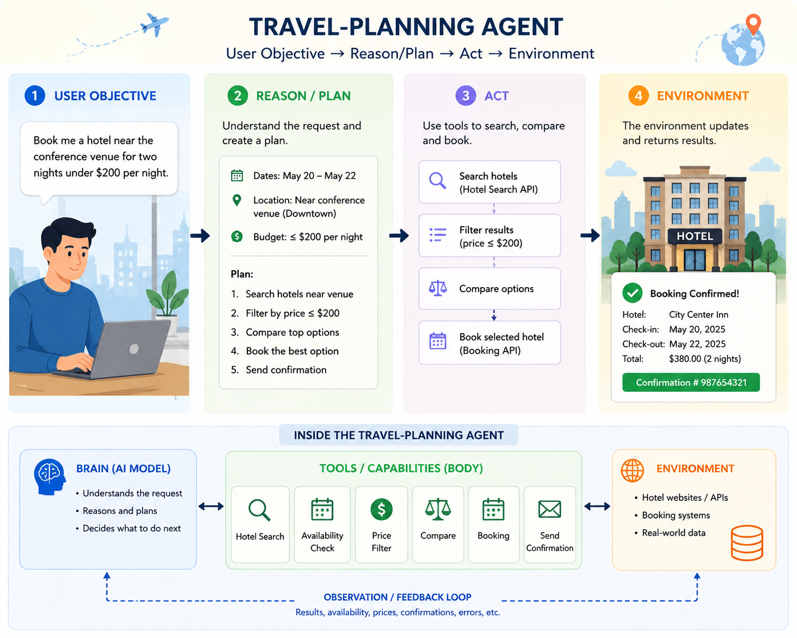
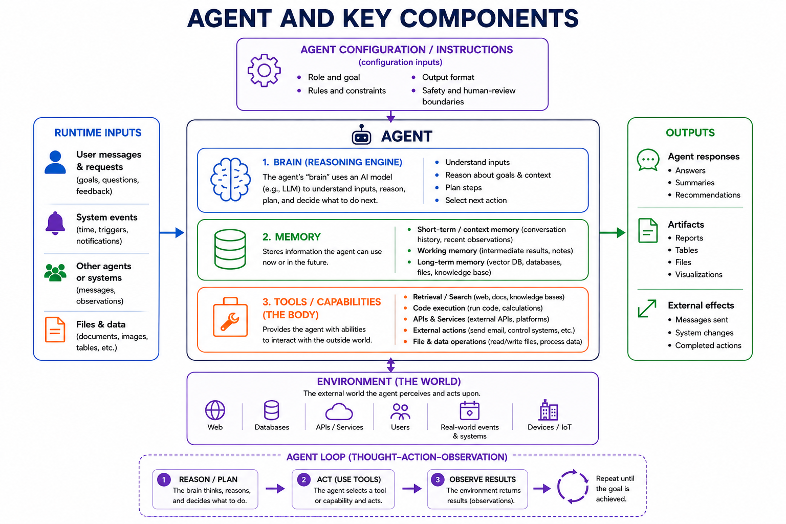
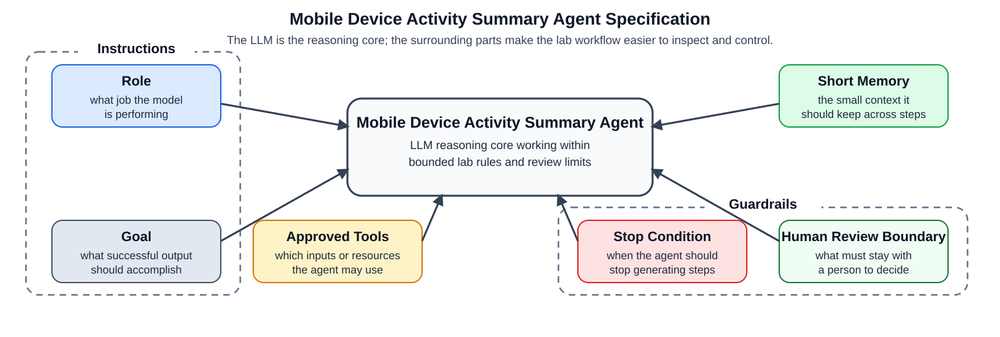
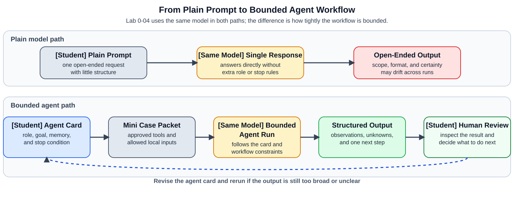

# Agent Concepts: From Models to Bounded Workflows

This short reading uses a familiar task to show what an AI agent does. You do not need to memorize technical terms at the start. First, focus on what the agent is trying to accomplish; later sections name the parts that help it work safely and predictably.

## A Travel-Planning Agent Example

Imagine asking a digital assistant: “Find me a hotel near the conference venue for two nights under $200 per night.” The assistant checks available hotels, compares options that meet the request, and returns the reservation result. With the user's approval, it can also make the booking.



*Figure 0A. A travel-planning agent helps with a complete task: it starts with a request, searches and compares hotels, and returns a booking result.*

Read Figure 0A from left to right:

- The user explains what they need: a hotel near the venue, for two nights, within a budget.
- The agent works out what to look for and checks the available options.
- The agent uses the hotel service to compare choices and, after approval, make a reservation.
- The hotel system returns a confirmation, or explains a problem such as no available rooms. That result helps the agent decide what to do next.

The key idea is simple: an agent can use information and tools to help complete a task, rather than only write an answer.

## Classical AI Definition of an Agent

A foundational definition of an agent is simple: it perceives an environment and acts on that environment. In classical AI, the environment provides percepts to the agent, and the agent produces actions that affect the environment.

At a high level, the agent receives information, decides what to do, acts, and then uses the result to guide what happens next. The travel example follows that same general loop.

**The travel example in agent terms.** The same story can now be described more precisely:

- **User objective:** “Book me a hotel near the conference venue for two nights under $200 per night.”
- **Reason / plan:** The agent identifies the dates, location, budget, and other constraints, then decides to search for and compare available hotels.
- **Act:** It uses hotel-search and booking tools to check availability, compare options, and make the reservation after the required approval.
- **Environment:** The hotel reservation system is updated, and the booking confirmation is returned to the user.

In compact form:

```text
Find hotel → evaluate options → select/book → reservation system updated
```

This example makes both reasoning and tool use visible. The next sections explain the general agent architecture behind it.

Figure 0B shows the classical version of this idea: the agent receives information from the environment, chooses an action, and that action changes the environment. Notice that the arrows form a loop rather than a one-time question-and-answer exchange.


*Figure 0B. Classical AI agent-environment view from Poole and Mackworth, [Agents and Environments](https://artint.info/3e/html/ArtInt3e.Ch2.S1.html): the agent receives percepts from the environment and produces actions that affect the environment.*

## A Modern LLM-Based Agent

In modern AI systems, many agents use an `LLM` as the reasoning engine inside that larger loop. The agent combines the model with persistent instructions, memory, and tools so it can interpret inputs, reason through goals and context, take actions, and use the results of those actions in later steps.



*Figure 0C. Agent and key components: configuration and instructions define the agent's role and boundaries; it then receives inputs, uses a reasoning model, memory, and tools to act in an environment, and observes results in a repeating thought–action–observation loop.*

## Classical and LLM-Based Agents

Figure 0C is a modern version of the same basic agent idea in Figure 0B. Both receive information from an environment, decide what to do, act, and use the result to guide later behavior. The main difference is the component that makes the decisions and the interface used to act:

| Classical AI agent                                                          | LLM-based agent                                                                                                     |
| --------------------------------------------------------------------------- | ------------------------------------------------------------------------------------------------------------------- |
| **sensors** receive percepts from the environment                           | **inputs** include user requests, events, messages, and files or data                                               |
| a**controller** uses rules, search, planning, or a learned policy to decide | an**LLM reasoning engine** interprets the context, reasons, plans, and selects a next action                        |
| **actuators** carry out actions in the environment                          | **tools and capabilities** retrieve information, run code, call APIs, edit files, or take approved external actions |

Memory, instructions, retrieval, and guardrails are common additions around the LLM. They help the agent retain useful context, work with information outside the model, and stay within defined limits.

Figure 0C includes the agent configuration/instructions that set the agent's role and boundaries, as well as the components that carry out the work. Each has a simple purpose:

- `inputs`: user requests, system events, messages from other agents or systems, and files or data that give the agent something to work on
- `agent configuration / instructions`: persistent guidance that defines the agent's role and goal, rules and constraints, output format, and safety or human-review boundaries
- `brain / reasoning engine`: the AI model or `LLM` that understands inputs, reasons about goals and context, plans steps, and selects the next action
- `memory`: information the agent keeps while working, such as conversation history, intermediate notes, stored documents, databases, or a knowledge base
- `tools / capabilities`: the ways an agent interacts with the outside world, including retrieval or search, code execution, APIs and services, external actions, and file or data operations
- `environment`: the external world the agent can observe or act on, such as websites, databases, services, users, events, and devices
- `outputs`: responses and artifacts the agent produces, plus external effects such as sent messages, system changes, or completed actions
- `agent loop`: the repeating cycle of reasoning or planning, acting with a selected tool, and observing the result until the goal or stop condition is reached

## What Is a Bounded Agent?

A bounded agent has a limited job and clear operating limits. It is told which information and tools it may use, what context it should keep, when it should stop, and which decisions must remain with a person. These boundaries make its behavior easier to inspect and reduce the risk that it will make unsupported claims or take an unauthorized action.

Core boundaries in a bounded-agent specification are:

- `role`: tells the model what job it is performing in this workflow
- `goal`: tells the model what a successful result should accomplish
- `approved tools`: limits which inputs or resources the agent is allowed to use
- `stop condition`: tells the agent when it should stop instead of continuing to generate more steps
- `human review boundary`: marks the decisions or judgments that should stay with a person

An agent may also use `short memory`: a limited amount of context it carries across steps. Memory is optional, not part of the definition of a bounded agent. If an agent uses memory, limiting its scope is another useful boundary. Memory is not the same as a tool call; memory is what the agent keeps, while tools are what it uses to gather information or do work.

Figure 0C uses broader architecture terms for these boundaries and optional design choices:

| Bounded-agent boundary or design choice | AI-agent component in Figure 0C |
| --- | --- |
| `role`, `goal`, `stop condition`, `human review boundary` | agent configuration / instructions |
| `approved tools` | tools / capabilities |
| optional `short memory` | memory |

The `LLM` is the reasoning core that uses these configured components.

Some actions have real consequences. For example, a booking agent should follow its approval and payment rules before it commits a reservation.

## A Course Example: Mobile Device Activity Summary Agent

Assume a synthetic case packet from a clinic-issued Google Pixel 7 running Android 14. A clinic supervisor submitted the phone after noticing after-hours activity involving a screenshot of a staff schedule.

The `Mobile Device Activity Summary Agent` is one example of a bounded agent. It does not examine the physical phone directly. It reads only the approved case brief, artifact manifest, and short event log. Its narrow job is to summarize the activity those materials show, identify what remains unknown, and recommend one next step for a human reviewer. It must not decide whether misconduct or a security incident occurred.

Figure 0D shows this course example. Its role, approved tools, short memory, stop condition, and human-review boundary make its first-pass review limited and inspectable:



*Figure 0D. A course example of a bounded-agent specification: the LLM is the reasoning core, while role, goal, approved tools, short memory, stop condition, and a human-review boundary keep the device-activity review limited and inspectable.*

## Plain Model or Bounded Workflow?

Figure 0E is a quick map of the comparison you will make in the walkthrough. The top path shows a plain prompt sent directly to a model. The bottom path shows the same model bounded by an agent specification, a small case packet, approved inputs, and a human-review step.



*Figure 0E. Plain model versus bounded agent workflow for Lab 0-04: a single plain prompt can lead to an open-ended answer, while an agent specification plus a mini case packet turns the same model into a bounded workflow that produces structured output for human review.*

Next, open [03_agent_walkthrough.ipynb](03_agent_walkthrough.ipynb). You will compare the two paths using the same model and synthetic case packet.
