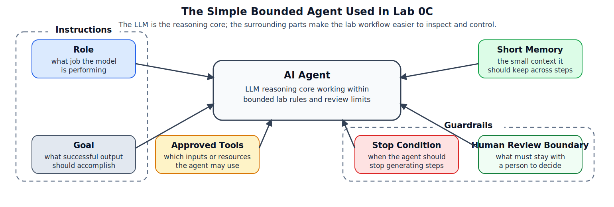
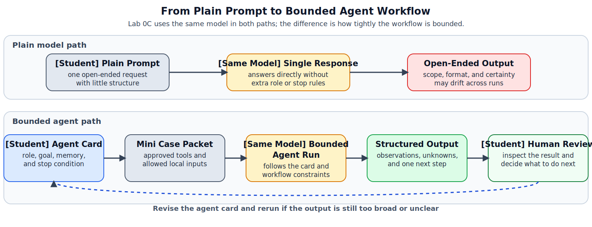

# Lab 0C: What Is an AI Agent?

## Purpose

Use this onboarding lab after you complete [lab0_2_model_warmup/01_instructions.md](../lab0_2_model_warmup/01_instructions.md). The goal is to make the idea of an AI agent concrete before you start the five pattern labs.

## Lab-Specific Environment

Before running the walkthrough notebooks, create a lab-local `.env` in this folder:

```bash
cp .env.example .env
```

This warm-up reads `MODEL` and `OLLAMA_BASE_URL` from `lab0_3_what_is_an_agent/.env`, so you can change settings here without affecting Lab 0A, Lab 0B, or the later pattern labs.

This lab is hands-on. You will run the same model in two different ways:

- first as a plain model answering an open-ended prompt
- then as a bounded device-activity review agent with a role, approved tools, short memory, and a stop condition

Then you will design a small agent specification of your own and test it on the same mini case packet.

In the walkthrough notebook, you will test a simple `Device Activity Summary Agent` on that mini case packet before designing your own version.

## Learning Goals

By the end of this warm-up lab, you should be able to:

- explain the difference between a plain model response and an agent workflow
- identify the main parts of an instructional AI agent in this course:
  - role
  - goal
  - approved tools
  - short memory
  - stop condition
  - human review boundary
- run a small agent-style device-activity review task on a synthetic case packet
- revise an agent specification so the model behaves in a more bounded and inspectable way

## What Is an Agent?

One standard AI definition is simple: an agent perceives an environment and acts on that environment. In classical AI, the environment provides inputs to the agent, and the agent sends actions back to the environment.


*Figure 0A. Standard agent-environment view from Poole and Mackworth, [Agents and Environments](https://artint.info/3e/html/ArtInt3e.Ch2.S1.html): the agent receives percepts from the environment and produces actions that affect the environment.*

## A Modern LLM-Based Agent

In modern AI systems, many agents use an `LLM` as the reasoning engine inside that larger loop. A helpful modern definition from Microsoft describes an AI agent as a flexible software program that uses generative AI models to interpret inputs, reason through problems, and decide on appropriate actions based on context.


*Figure 0B. Modern LLM-based agent view from Microsoft, [AI agent adoption](https://learn.microsoft.com/en-us/azure/cloud-adoption-framework/ai-agents/): a language model works with instructions, knowledge or retrieval, tools or actions, and memory to produce useful outputs.*

In Figure 0B, each component has a simple purpose:

- `model`: the reasoning engine that generates the next response or action
- `instructions`: the goals, rules, and boundaries that shape the agent's behavior
- `knowledge / retrieval`: outside information the agent can look up or use for grounding
- `tools / actions`: functions, APIs, or systems the agent can use to do work
- `memory`: stored history or state the agent can carry across steps

## What Each Agent Part Does

Lab 0C uses a simpler bounded version of that modern agent idea. In the walkthrough notebook, these parts are used to define the `Device Activity Summary Agent`. In the notebook, you will define the agent with a small agent specification, and the figure below shows the visible design parts that keep its behavior easier to inspect and control:



*Figure 0C. Device Activity Summary Agent specification: in the walkthrough example, the LLM is still the reasoning core, while role, goal, approved tools, short memory, stop condition, and a human-review boundary keep the workflow bounded and inspectable.*

You can think of the lab version as a teaching-friendly simplification of the modern agent figure:

- `LLM` or model: the reasoning core inside the agent
- instructions: expressed in this lab as `role`, `goal`, and behavioral boundaries
- knowledge, retrieval, and actions: simplified here as `approved tools` and the case packet the agent is allowed to use
- memory: kept here as a separate idea and simplified as `short memory`
- additional course guardrails: `stop condition` and `human review boundary`

In other words, `memory` is not the same thing as a tool call. Memory is what the agent keeps across steps, while tools or actions are what the agent uses to gather information or do work.

- `role`: tells the model what job it is performing in this workflow
- `goal`: tells the model what a successful result should accomplish
- `approved tools`: limits which inputs or resources the agent is allowed to use
- `short memory`: keeps the small amount of context the agent should carry across steps
- `stop condition`: tells the agent when it should stop instead of continuing to generate more steps
- `human review boundary`: marks the decisions or judgments that should stay with a person

## Instructional Figure

To make the comparison in this lab easier to see, use Figure 0D as a quick map. The top path shows a plain prompt sent directly to a model. The bottom path shows the same model bounded by an agent specification, a small case packet, approved inputs, and a human-review step.



*Figure 0D. Plain model versus bounded agent workflow for Lab 0C: a single plain prompt can lead to an open-ended answer, while an agent specification plus a mini case packet turns the same model into a bounded workflow that produces structured output for human review.*

## What To Do

Complete the steps in this order:

1. Finish [lab0_1_environment_setup/03_environment_check.ipynb](../lab0_1_environment_setup/03_environment_check.ipynb), [lab0_1_environment_setup/04_setup_assignment.ipynb](../lab0_1_environment_setup/04_setup_assignment.ipynb), and [lab0_2_model_warmup/03_prompt_revision_assignment.ipynb](../lab0_2_model_warmup/03_prompt_revision_assignment.ipynb).
2. Open [02_agent_walkthrough.ipynb](02_agent_walkthrough.ipynb).
3. Run the notebook from top to bottom.
4. Compare the plain-model response with the agent response.
5. Pay attention to which parts of the agent specification change the behavior of the same model.
6. Open [03_agent_design_assignment.ipynb](03_agent_design_assignment.ipynb).
7. Edit the student agent specification in the notebook so it has a clear role, goal, memory, and human-review rule.
8. Rerun the notebook and review how your agent design changes the output.
9. Complete the short reflection at the end of each notebook.

## Mini Case Packet

This lab uses a small synthetic mini case packet in [data/](data):

- `case_brief.md`
- `artifact_manifest.json`
- `triage_events.csv`

Optional supporting file:

- `chain_of_custody.csv`

The packet is intentionally small so you can focus on the agent concept rather than a long forensic analysis. In this lab, the main task is to summarize simple device activity, note what is still unknown, and recommend one next human review step.

The `triage_events.csv` file is written in plain language on purpose. Read each row as a short timeline note about what happened on the device.

## Success Criteria

You have completed this warm-up lab when:

- you run [02_agent_walkthrough.ipynb](02_agent_walkthrough.ipynb) successfully
- you compare the same model in plain-prompt form and agent form
- you can point to the role, tools, memory, stop condition, and output schema in the agent notebook
- you edit and rerun the student agent specification in [03_agent_design_assignment.ipynb](03_agent_design_assignment.ipynb)
- you complete the reflection sections

## After This Warm-Up

Move on to the main forensic labs in order:

1. `lab1_reflection_pattern`
2. `lab2_tool_use_pattern`
3. `lab3_react_pattern`
4. `lab4_planning_pattern`
5. `lab5_multiagent_pattern`
