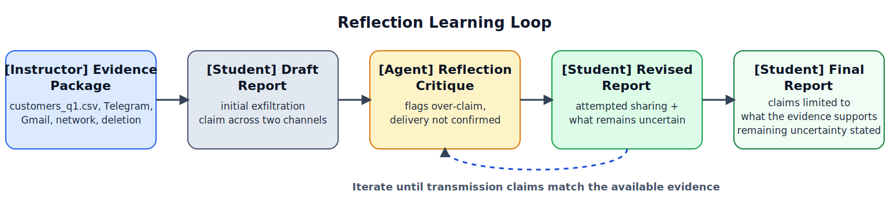

# Lab 1: Reflection Pattern for Evidence-Bounded Reasoning

Lab 1 introduces the Reflection Pattern as a structured quality-control loop for forensic reasoning. Students analyze artifacts from one mobile case, produce an initial report, receive critique from an LLM-based reflection agent, and revise their conclusions to make them more defensible. The instructional emphasis is not answer generation, but disciplined claim validation, uncertainty handling, and clear reasoning.

## Lab-Specific Environment

Before running `03_lab_notebook.ipynb`, create a lab-local `.env` in this folder:

```bash
cp .env.example .env
```

This notebook reads `MODEL` and `OLLAMA_BASE_URL` from `lab1_reflection_pattern/.env`, so you can change models here without affecting the other labs.

## Educational Objective

The objective of Lab 1 is to build students' ability to produce mobile forensic conclusions that stay within what the evidence supports by applying iterative critique and revision.

## Learning Outcomes

By the end of Lab 1, students will be able to:

1. Distinguish observed facts from inferences in a mobile forensic report.
2. Map investigative claims to specific artifacts and timestamps.
3. Revise over-claimed conclusions after structured reflection feedback.
4. Explain what remains uncertain using defensible confidence language.

## Measurable Targets

1. At least 80% of final-report claims are mapped to explicit artifact evidence.
2. Final reports contain zero major unsupported conclusions.
3. At least 85% of timeline events in the final report are correctly ordered and timestamped.
4. Draft-to-final rubric score improves by at least 20% on average per cohort.

## Assessment Method

Student performance is scored with a shared rubric applied to Draft Report v1 and Final Report v2/v3. The rubric uses a 0-4 scale per dimension (linking claims to evidence, reasoning validity, timeline accuracy, and uncertainty handling). Draft-to-final gain is computed per student and aggregated at cohort level to evaluate achievement of the measurable targets.

When staffing permits, a subset of submissions may be double-scored, and discrepancies are reconciled using a shared scoring guide. Lab-level reporting includes target attainment rates and average improvement between initial and final submissions.

## Instructional Flow and Guided Example

To illustrate the Reflection workflow and assessment logic, we include the following guided example. Read `02_case_overview.md` for the full case facts, acquisition details, and event sequence; the full lab extends the same scenario with a larger artifact set.
Before applying Reflection to this forensic case, it helps to recall the general pattern: produce an initial answer, critique it, and revise it. Figure 1 shows that general Reflection Pattern.


*Figure 1. General Reflection Pattern: an initial response is reviewed through reflection and then revised. Temporary linked figure from Avi Chawla, [5 Agentic AI design patterns](https://www.dailydoseofds.com/p/5-agentic-ai-design-patterns/), published January 24, 2025. A local backup is saved under `references/dailydoseofds_5_agentic_patterns/` for later redraw work.*

In this lab, that same loop is narrowed to forensic reporting, where revision must stay within what the evidence supports. As shown in Figure 2, the lab uses an iterative cycle from artifact analysis to draft findings, reflection critique, and revision limited to what the evidence supports.



*Figure 2. Reflection-based learning loop for Lab 1: mobile artifacts -> Draft v1 -> critique -> revised report -> final improved report.*

Student-agent interaction is explicit and structured in each iteration. The student submits Draft Report v1 with evidence-to-claim links, the LLM-based reflection agent returns critique on claim support and uncertainty language, and the student decides how to revise claims and confidence statements before submitting v2/v3. The agent acts as a critique aid, not a decision authority: students remain responsible for final forensic conclusions and evidence citations.

## Guided Example

This lab asks students to decide what the evidence supports about suspicious late-night activity involving `customers_q1.csv` on a company-issued Android phone. The key reflection move is to separate supported observations such as file preparation, staging, and outbound activity from stronger but unsupported claims about completed transmission.

Student Draft v1:  
"The employee exfiltrated `customers_q1.csv` to an outside party through Telegram and Gmail."

Reflection Critique:  
"This conclusion is over-claimed. The artifacts support file preparation, Telegram staging, outbound messaging, outbound network activity, and later deletion of the source file. They do not independently confirm recipient receipt or prove that the same file was successfully transmitted through both Telegram and Gmail. Separate observed events from inferred transmission and explain what remains uncertain."

Student Final v2:  
"Artifacts show that `customers_q1.csv` was prepared on the device, copied into Telegram application storage, and followed by outbound Telegram and Gmail activity consistent with attempted external sharing. This supports a defensible conclusion that the user engaged in activity consistent with trying to share the file or its contents outside the organization. The current artifacts do not independently confirm completed delivery to a recipient or show that the same file was successfully transmitted through both channels."

This example shows the core learning mechanism: Reflection moves students from strong but unsupported claims to conclusions limited to what the evidence supports.

In the actual lab, students work on the full staged case package described in `02_case_overview.md`, with additional app metadata, attachment records, timeline entries, and network slices. Required deliverables are Draft Report v1, critique log, Final Report v2/v3, and a table linking claims to evidence. Evaluation uses rubric dimensions for linking claims to evidence, reasoning validity, timeline accuracy, uncertainty handling, and measurable revision improvement.

Students should work through this lab in order: `01_instructions.md`, `02_case_overview.md`, then `03_lab_notebook.ipynb`.

The staged artifact package in `data/` includes `artifact_manifest.json`, `file_events.csv`, `app_db_messages.csv`, `network_events.csv`, `location_events.csv`, and `chain_of_custody.csv`.
