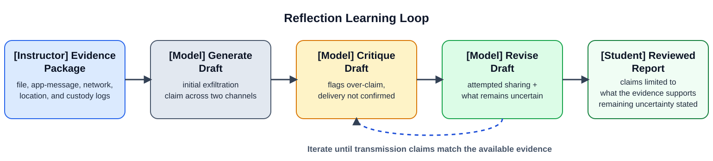

# Lab 1: Reflection Pattern for Evidence-Bounded Reasoning

## Purpose

Lab 1 introduces the Reflection Pattern as a structured quality-control loop for forensic reasoning. Students analyze artifacts from one mobile case, inspect a model-generated report and reflection critique, then evaluate whether the revised claims are more defensible. The instructional emphasis is not answer generation, but disciplined claim validation, uncertainty handling, and clear reasoning.

## Learning Outcomes

By the end of Lab 1, students will be able to:

1. Distinguish observed facts, inferences, and unsupported claims in a mobile forensic report.
2. Link investigative claims to specific artifacts and timestamps.
3. Evaluate whether reflection feedback makes a model-generated report more evidence-bounded.
4. Explain remaining uncertainty and identify a forensic judgment that requires human review.

## The General Reflection Pattern

The animation below shows the general Reflection Pattern: generate an answer, critique it, and revise it. In this lab, that general loop is narrowed to evidence-bounded forensic reporting.


*Figure 1. General Reflection Pattern animation: a query produces an initial output, reflection produces a reflected output, and the cycle iterates before returning a response. Adapted from Avi Chawla, [5 Agentic AI design patterns](https://www.dailydoseofds.com/p/5-agentic-ai-design-patterns/).*

- **Query:** the task given to the model. In this lab, it asks for a report based on the forensic artifacts.
- **Initial Output:** the model's first report before critique.
- **Reflect:** the model, in its critique role, reviews the draft for claims that may be unsupported, missing evidence links, and weak uncertainty language.
- **Reflected Output:** the model revises its report using that critique.
- **Iterate:** if material issues remain, the critique-and-revision cycle repeats. You review the final output and decide whether its claims are actually supported.
- **Response:** when the cycle stops, the revised output is returned as the response for a student to review.

## The Case Scenario

Investigators are reviewing a company-issued Android phone in a synthetic suspected customer-data exfiltration case involving `customers_q1.csv`. The artifacts show the file being staged in Telegram storage, followed by Telegram and Gmail messages, related network activity, and deletion of the original file from Downloads.

Those events do not, by themselves, prove that the file was successfully delivered to another person. Your task is to determine what the evidence supports, identify what remains uncertain, and evaluate whether reflection makes the report more defensible.

**Reflection is used to:**

- identify unsupported claims or missing evidence links;
- make remaining uncertainty explicit;
- revise the report so it stays within what the artifacts support.

## The Reflection Workflow in This Lab

The Lab 1 workflow below applies the same pattern to the synthetic case. The same configured model takes different roles through its instructions: it drafts a report, critiques the draft, and revises the report. Together, those repeated model calls form the reflection-agent workflow. You inspect each stage and decide whether the final claims and evidence links are defensible.



*Figure 2. Reflection-based learning loop for Lab 1: mobile artifacts -> model generates a draft -> model critiques the draft -> model revises the draft -> student-reviewed report.*

**Figure 2, box by box:**

- **[Instructor] Evidence Package:** the instructor provides a synthetic collection of artifacts from the device and network, including file, app-message, network, location, and chain-of-custody logs.
- **[Model] Generate Draft:** the model receives the task and evidence package, then generates its first report. That draft may contain unsupported claims.
- **[Model] Critique Draft:** the same model receives the draft and its critique instructions. It produces critique results that identify unsupported claims, missing evidence links, and weak uncertainty language.
- **[Model] Revise Draft:** the generator, which still has the original evidence package in its conversation history, uses the critique to revise the report.
- **[Student] Reviewed Report:** you compare the revised claims with the original artifacts and decide whether the report is defensible.
- **Dashed iteration arrow:** the revised draft goes back for another critique. The review-and-revision cycle can repeat until no material problems remain or the workflow reaches its limit.

## Lab-Specific Environment

Before running `03_lab_notebook.ipynb`, create a lab-local `.env` in this folder:

```bash
cp .env.example .env
```

On Windows, use the command for your terminal:

```powershell
# PowerShell
Copy-Item .env.example .env
```

```bat
:: Command Prompt
copy .env.example .env
```

This notebook reads `MODEL` and `OLLAMA_BASE_URL` from `lab1_reflection_pattern/.env`, so you can change models here without affecting the other labs.
