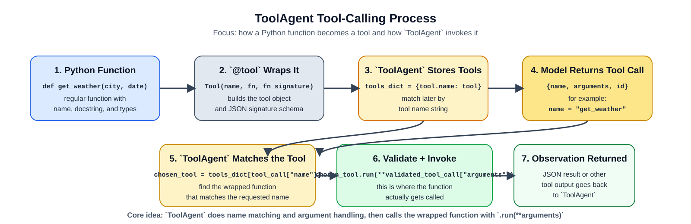

# Lab 2: Tool Use Pattern for Image Metadata Analysis and Vehicle Verification

## Purpose

Lab 2 introduces the Tool Use Pattern for evidence-bounded forensic reasoning. Students use local tools to locate relevant photos, inspect image evidence, and review online-sale records from one mobile case. They first run the tools directly, then inspect how `ToolAgent` selects and calls the same tools. The instructional emphasis is on choosing an appropriate tool, supplying valid arguments, separating tool output from interpretation, and reaching a conclusion that stays within the evidence.

## Learning Outcomes

By the end of Lab 2, students will be able to:

1. Select appropriate tools to locate photos and sale-related records created on or after January 2, 2026.
2. Execute tool calls with valid parameters to locate candidate media, inspect image evidence, and retrieve listing records.
3. Interpret combined image-evidence results by comparing photo content and timing with the stolen-vehicle description.
4. Produce a conclusion that distinguishes confirmed, likely, and unconfirmed evidence of online-sale preparation.
5. Explain when a `ToolAgent` tool choice, argument, or interpretation should be corrected or rejected based on the tool schema and available evidence.

## The General Tool Use Pattern

The animation below shows the general Tool Use Pattern: a model selects an external tool, receives the tool result, and uses that result to prepare its response. In this lab, the tools inspect local forensic evidence rather than relying on the model to infer facts on its own.


*Figure 1. General Tool Use Pattern: the model accesses external tools to retrieve or compute information before responding. Adapted from Avi Chawla, [5 Agentic AI design patterns](https://www.dailydoseofds.com/p/5-agentic-ai-design-patterns/).*

## Tool Use in This Lab

This lab applies the pattern to a synthetic case involving a stolen black SUV. The model does not inspect the phone data directly. Instead, it can request a defined local tool, receive that tool's result, and use the result in its next step. Students inspect the calls and outputs, then make the final forensic judgment.

Figure 2 shows the mechanics of one tool call. A Python function is wrapped as a `Tool`, stored by name, matched to the model's requested tool name, and then invoked by the program. The returned observation becomes information the model and student can use.



*Figure 2. ToolAgent calling process for Lab 2: Python function -> `@tool` wrapper -> stored `tools_dict` entry -> model tool-call object -> name matching -> function invocation -> returned observation.*

Figure 3 shows the case workflow. Students narrow the evidence, run structured tool calls, check the returned observations, and decide what the evidence supports about preparation for an online sale.


*Figure 3. Tool-use-pattern workflow for Lab 2: instructor-provided mobile evidence -> student date and file filtering -> student+agent structured tool calls -> agent-supported metadata and vehicle checking -> student conclusion about online-sale preparation.*

## Tool Selection Logic

Students are assessed on clear tool-selection reasoning, not on hidden model internals. Follow this decision logic and justify each step with the evidence needed:

1. Use `list_media_files` to locate candidate photos created on or after January 2, 2026.
2. Use `inspect_image_evidence` to inspect one candidate image at a time, combining file details, timestamps, vehicle detections, and comparison to the case description.
3. Use `inspect_listing_records` to identify online-sale drafts or related records tied to the same time period.
4. If the evidence is insufficient, inspect additional candidate images or run another justified follow-up call before revising the conclusion.

`ToolAgent` is a tool-use aid, not a decision authority. You remain responsible for accepting, correcting, or rejecting its suggestions and for justifying the conclusion.

## Required Outputs

Use the same report format for direct tool use and `ToolAgent` output so you can compare the two workflows. Your report must include:

1. `tool-call log`
2. `strongest timestamp evidence`
3. `strongest vehicle-match evidence`
4. `conclusion label (confirmed, likely, or unconfirmed) with confidence 0-1 per major claim`
5. `explicit evidence mapping and limits`

## Guided Example

In this lab, you must decide whether a recovered phone contains evidence that a stolen black SUV was photographed and prepared for online sale after January 2, 2026. The example below shows how a tool sequence turns media and listing records into an evidence-based conclusion.

| Tool Call | Tool Output | Why It Matters |
|---|---|---|
| `list_media_files(root="DCIM/Camera", date_from="2026-01-02T00:00:00Z")` | `IMG_2044.jpg`, `IMG_2045.jpg`, `IMG_2051.jpg` | narrows review to candidate photos created on or after the theft date |
| `inspect_image_evidence(file_name="IMG_2044.jpg", case_description="black SUV with roof rack")` | captured `2026-01-02 21:14 UTC`; black SUV; roof rack visible; strong match | combines the strongest timestamp and vehicle-match evidence for one candidate image |
| `inspect_listing_records(date_from="2026-01-02T00:00:00Z")` | draft created `2026-01-02 21:31 UTC`; title `black SUV for sale`; attached image `IMG_2044.jpg` | links the same photo to an online-sale draft |

**Overstated conclusion:** “The phone shows that the seller posted the stolen vehicle for sale online.”

**Evidence-bounded conclusion:** “The phone contains confirmed evidence that a black SUV matching the stolen vehicle was photographed on January 2, 2026 and attached to an online sale draft created later that evening. The records support preparation for an online sale, but they do not confirm that the listing was posted or that the vehicle was sold.”

The example shows the core learning point: ground every claim in explicit tool output and avoid conclusions beyond the observed evidence. The required notebooks provide the full staged case package, additional candidate images, partial matches, and listing records. External APIs and retrieval systems are optional extension ideas; they are not required for this lab.

## Lab-Specific Environment

Before running the Lab 2 notebooks, create a lab-local `.env` in this folder:

```bash
cp .env.example .env
```

On Windows, use the command for your terminal:

```powershell
# PowerShell
Copy-Item .env.example .env
```

```bat
:: Command Prompt
copy .env.example .env
```

These notebooks read `MODEL` and `OLLAMA_BASE_URL` from `lab2_tool_use_pattern/.env`, so you can tune the Tool Use lab independently of the others. The default example uses `qwen3:8b` because it has been the most stable option for the `ToolAgent` section with the current Ollama setup.
