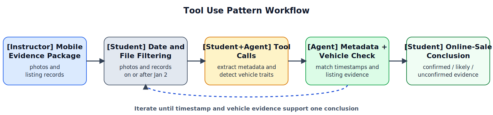

# Lab 2: Tool Use Pattern for Image Metadata Analysis and Vehicle Verification

Lab 2 applies the Tool Use Pattern as a structured workflow for extracting timestamps, checking image content, and evaluating online-sale evidence from mobile data. Students use an LLM-based tool-calling agent to select, call, and sequence analysis tools while remaining responsible for the final interpretation and conclusion. The instructional emphasis is on careful tool selection, valid parameters, and clear separation between raw tool output and analytic interpretation. Although students use ordered tool sequences, this lab focuses on tool execution and evidence validation rather than broader investigation planning.

## Educational Objective

The objective of Lab 2 is to build students' ability to sequence valid tool calls, interpret outputs, and produce an evidence-based conclusion about whether the phone contains confirmed, likely, or unconfirmed evidence that the stolen vehicle was photographed and prepared for an online sale.

## Learning Outcomes

By the end of Lab 2, students will be able to:

1. Select appropriate tools to locate relevant photos and sale-related records created on or after January 2, 2026.
2. Execute tool calls with valid parameters to extract image timestamps and related file metadata.
3. Use vehicle-detection results to compare photo content with the stolen vehicle description.
4. Produce a conclusion that distinguishes confirmed, likely, and unconfirmed evidence of online-sale preparation.
5. Explain when a tool-calling agent's suggested tool choice, arguments, or interpretation should be corrected or rejected based on the tool schema and the available evidence.

## Measurable Targets

1. At least 85% of students execute the required core tool sequence in valid order for the online-sale evidence task (`list_media_files` -> `extract_image_metadata` -> `detect_vehicle_attributes` -> `inspect_listing_records` -> `compare_vehicle_features`).
2. At least 90% of submitted tool calls use valid arguments and required formatting.
3. At least 80% of final submissions correctly classify the evidence as confirmed, likely, or unconfirmed preparation for an online sale using the shared scoring guide.
4. At least 85% of final submissions include specific file or record references for each major claim.
5. At least 80% of final submissions correctly identify both the strongest timestamp evidence and the strongest vehicle-match evidence in the shared scoring guide.
6. At least 80% of final submissions correctly explain one tool-calling suggestion that should be accepted, corrected, or rejected, with justification tied to the tool schema, argument validity, or missing evidence.

## Assessment Method

Student performance is scored with a shared rubric applied to a tool-call log and final report. The rubric uses a 0-4 scale per dimension (tool selection quality, argument validity, output interpretation, evaluation of agent tool suggestions, and conclusion support). Scores are aggregated at class level to evaluate attainment of the measurable targets. A sequence is scored as correct when the required core calls are executed in logical order before the final conclusion; optional additional calls are allowed but do not replace the required calls.

When staffing permits, a subset of submissions may be scored by two reviewers, with differences reconciled through a shared scoring guide. Lab-level reporting includes target attainment rates, timestamp-and-vehicle-match accuracy, and common problems (invalid arguments, uncritical acceptance of agent tool suggestions, missing evidence references, and over-claimed conclusions).

## Instructional Flow and Guided Example

To illustrate the Tool Use Pattern workflow and assessment logic, we include the following guided example. Read `02_case_overview.md` for the full case facts, timeline, and artifact list; the full lab extends the same scenario with additional photos, records, and tool options.
Before applying Tool Use to this forensic case, it helps to recall the general pattern: the model uses external tools to gather evidence it cannot safely infer from its own weights alone. Figure 1 shows that general Tool Use Pattern.

*Figure 1. General Tool Use Pattern: the model accesses external tools to retrieve or compute information before responding. Temporary linked figure from Avi Chawla, [5 Agentic AI design patterns](https://www.dailydoseofds.com/p/5-agentic-ai-design-patterns/), published January 24, 2025. A local backup is saved under `references/dailydoseofds_5_agentic_patterns/` for later redraw work.*

In this lab, that same pattern is narrowed to forensic review, where students must choose valid tools, inspect the outputs, and distinguish raw results from analytic conclusions. As shown in Figure 2, the lab progresses from evidence intake to date-and-file filtering, structured tool calls, output checking, and a final conclusion about online-sale preparation.

*Figure 2. Tool-use-pattern workflow for Lab 2: instructor-provided mobile evidence -> student date and file filtering -> student+agent structured tool calls -> agent-supported metadata and vehicle checking -> student conclusion about online-sale preparation.*

## Tool Selection Logic

Students are assessed on clear tool-selection reasoning, not on hidden model internals. In practice, students should follow this decision logic and justify each step with the evidence they need:

1. Use `list_media_files` to locate candidate photos created on or after January 2, 2026.
2. Use `extract_image_metadata` to inspect capture times and other relevant image metadata.
3. Use `detect_vehicle_attributes` to determine whether a photo likely shows the stolen vehicle.
4. Use `inspect_listing_records` to identify online sale drafts or related records tied to the same time period.
5. Use `compare_vehicle_features` to compare detected vehicle traits with the known vehicle description.
6. If evidence is insufficient, run additional justified tool calls and revise the conclusion.

The agent acts as a tool-use aid, not a decision authority: students remain responsible for accepting, rejecting, and justifying those suggestions.

## Guided Example

In this lab, students must decide whether a recovered phone contains evidence that a stolen black SUV was photographed and prepared for online sale after January 2, 2026. The example below focuses on how a tool sequence turns raw media and listing records into an evidence-based conclusion.

| Tool Call | Tool Output | Why It Matters |
|---|---|---|
| `list_media_files(root="gallery/", date_from="2026-01-02")` | `IMG_2044.jpg`, `IMG_2045.jpg`, `IMG_2051.jpg` | narrows review to candidate photos created on or after the theft date |
| `extract_image_metadata(file_path="IMG_2044.jpg")` | captured `2026-01-02 21:14 UTC`; no later edit time recorded | places the photo after the theft date and inside the reviewed time range |
| `detect_vehicle_attributes(file_path="IMG_2044.jpg")` | black SUV; roof rack visible; rear plate region visible | links the image content to the stolen vehicle description |
| `inspect_listing_records(source="listing_drafts.json", date_from="2026-01-02")` | draft created `2026-01-02 21:31 UTC`; title `black SUV for sale`; attached image `IMG_2044.jpg` | links the same photo to an online-sale draft |
| `compare_vehicle_features(case_description="black SUV with roof rack", detected_attributes=["black","SUV","roof rack"])` | strong match; no conflicting features | supports a high-confidence link between the photo and the stolen vehicle |

Student Draft v1:  
"The phone shows that the seller posted the stolen vehicle for sale online."

Student Final v2:  
"The phone contains confirmed evidence that a black SUV matching the stolen vehicle was photographed on January 2, 2026 and attached to an online sale draft created later that evening. The records support preparation for an online sale, but they do not confirm that the listing was posted or that the vehicle was sold."

This draft-to-revision contrast shows the Tool Use Pattern objective: students must tie each claim to specific tool outputs and label confidence without going beyond the observed evidence.

This example shows the main learning point: Tool Use Pattern instruction requires students to ground every claim in explicit tool outputs and avoid conclusions beyond observed evidence.

In the actual lab, students analyze the full staged case package described in `02_case_overview.md`, with additional photos, partial matches, and multiple listing records. Required deliverables are a tool-call log, a final report, and a table linking claims to evidence.

Students should work through this lab in order: `01_instructions.md`, `02_case_overview.md`, then `03_lab_notebook.ipynb`.

The staged artifact package in `data/` includes `artifact_manifest.json`, `media_index.csv`, `image_metadata.csv`, `vehicle_detections.csv`, `listing_drafts.json`, and `chain_of_custody.csv`.
