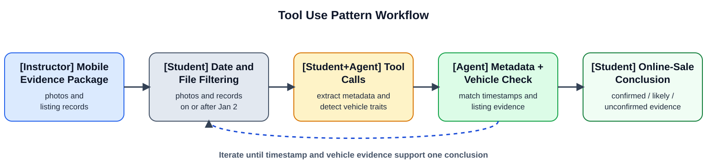

# Lab: Tool Use Pattern for Image Metadata Analysis and Vehicle Verification

## Purpose

This lab introduces the Tool Use Pattern for evidence-bounded forensic reasoning. Students use local tools to locate relevant photos, inspect image evidence, and review online-sale records from one mobile case. They first run the tools directly, then inspect how `ToolAgent` selects and calls the same tools. The instructional emphasis is on choosing an appropriate tool, supplying valid arguments, separating tool output from interpretation, and reaching a conclusion that stays within the evidence.

## Learning Outcomes

By the end of this lab, students will be able to:

1. Select appropriate tools to locate photos and sale-related records created on or after January 2, 2026.
2. Execute tool calls with valid parameters to locate candidate media, inspect image evidence, and retrieve listing records.
3. Interpret combined image-evidence results by comparing photo content and timing with the stolen-vehicle description.
4. Produce a conclusion that distinguishes confirmed, likely, and unconfirmed evidence of online-sale preparation.
5. Explain when a `ToolAgent` tool choice, argument, or interpretation should be corrected or rejected based on the tool schema and available evidence.

## The General Tool Use Pattern

The animation below shows the general Tool Use Pattern: a model selects an external tool, receives the tool result, and uses that result to prepare its response. In this lab, the tools inspect local forensic evidence rather than relying on the model to infer facts on its own.


*Figure 1. General Tool Use Pattern: the model accesses external tools to retrieve or compute information before responding. Adapted from Avi Chawla, [5 Agentic AI design patterns](https://www.dailydoseofds.com/p/5-agentic-ai-design-patterns/).*

**Figure 1, component by component:**

- **User:** the person who needs an answer. In this lab, the student asks an evidence question about the recovered phone.
- **Query:** the question or task that the user asks the model. Here, it asks whether the phone contains evidence that the stolen vehicle was prepared for online sale.
- **LLM:** the model reads the query and decides whether it needs evidence from a tool before answering.
- **Tool Calling:** the agent receives the model's requested tool name and arguments, calls the matching local tool, and returns that tool's observation to the model.
- **Vector Database / Tools & APIs:** possible sources of information or computation. This lab uses local forensic tools; vector databases and external APIs are optional extensions, not required parts of the lab.
- **LLM (Generate):** after receiving the tool result, the model uses the observation to generate an evidence-based answer.
- **Response:** the generated answer returned to the user. Students review it and remain responsible for the final forensic conclusion.

## The Case Scenario

After a black SUV with a roof rack was reported stolen, investigators recovered an Android phone. Its records include a saved listing draft titled `black SUV for sale` with `IMG_2044.jpg` attached.

Your task is to determine whether the phone contains confirmed, likely, or unconfirmed evidence that a stolen black SUV was photographed and prepared for an online sale after January 2, 2026.

Classify the result as:

- **Confirmed:** direct tool outputs support each part of the task.
- **Likely:** the outputs suggest the conclusion, but an important link is missing or weak.
- **Unconfirmed:** the outputs do not adequately support the conclusion.

**Your focus is to:**

- choose the right local tool and valid arguments for each evidence question;
- read the returned observations rather than guessing from the model;
- connect timestamps, vehicle attributes, and listing records;
- explain what the evidence does not prove.

## Tools Available in This Case

- **`list_media_files`:** finds candidate photos by folder and date.
- **`inspect_image_evidence`:** examines one photo's metadata and vehicle features.
- **`inspect_listing_records`:** retrieves saved online-sale listing records.

## The Tool Use Workflow in This Lab

The workflow below applies the same pattern to the case. The model does not inspect the phone data directly. Instead, it can request a defined local tool, receive that tool's result, and use the result in its next step. Students inspect the calls and outputs, then make the final forensic judgment.

Figure 2 shows the case workflow. Students narrow the evidence, run structured tool calls, check the returned observations, and decide what the evidence supports about preparation for an online sale.



*Figure 2. Tool-use-pattern workflow for this lab: instructor-provided mobile evidence -> student date and file filtering -> student+agent structured tool calls -> agent-supported metadata and vehicle checking -> student conclusion about online-sale preparation.*

**Figure 2, box by box:**

- **[Instructor] Mobile Evidence Package:** the instructor provides the gallery, image metadata, vehicle-detection, listing-draft, and chain-of-custody records.
- **[Student] Date and File Filtering:** you use the case date and file information to narrow the evidence to candidate photos and records relevant to the stolen vehicle.
- **[Student+Agent] Tool Calls:** direct tool use and `ToolAgent` both call the same local tools with arguments that identify the evidence to inspect.
- **[Agent] Metadata + Vehicle Check:** the agent uses the returned tool observations to compare timestamps, vehicle attributes, and listing evidence with the case description.
- **[Student] Online-Sale Conclusion:** you classify the evidence as confirmed, likely, or unconfirmed and explain the evidence mapping and limits.
- **Dashed iteration arrow:** if a tool result is insufficient or raises a new question, return to filtering and make another justified tool call before reaching the conclusion.

## Choosing the Right Tool

Students are assessed on clear tool-selection reasoning, not on hidden model internals. Follow this decision logic and justify each step with the evidence needed:

1. Use `list_media_files` to locate candidate photos created on or after January 2, 2026.
2. Use `inspect_image_evidence` to inspect one candidate image at a time, combining file details, timestamps, vehicle detections, and comparison to the case description.
3. Use `inspect_listing_records` to identify online-sale drafts or related records tied to the same time period.
4. If the evidence is insufficient, inspect additional candidate images or run another justified follow-up call before revising the conclusion.

`ToolAgent` is a tool-use aid, not a decision authority. You remain responsible for accepting, correcting, or rejecting its suggestions and for justifying the conclusion.

## Guided Example

In this lab, you must decide whether a recovered phone contains evidence that a stolen black SUV was photographed and prepared for online sale after January 2, 2026. The example below shows how a tool sequence turns media and listing records into an evidence-based conclusion.

| Tool Call | Tool Output | Why It Matters |
|---|---|---|
| `list_media_files(root="DCIM/Camera", date_from="2026-01-02T00:00:00Z")` | `IMG_2044.jpg`, `IMG_2045.jpg`, `IMG_2051.jpg` | narrows review to candidate photos created on or after the theft date |
| `inspect_image_evidence(file_name="IMG_2044.jpg", case_description="black SUV with roof rack")` | captured `2026-01-02 21:14 UTC`; black SUV; roof rack visible; strong match | combines the strongest timestamp and vehicle-match evidence for one candidate image |
| `inspect_listing_records(date_from="2026-01-02T00:00:00Z")` | draft created `2026-01-02 21:31 UTC`; title `black SUV for sale`; attached image `IMG_2044.jpg` | links the same photo to an online-sale draft |

**Overstated conclusion:** “The phone shows that the seller posted the stolen vehicle for sale online.”

**Evidence-bounded conclusion:** “The phone contains confirmed evidence that a black SUV matching the stolen vehicle was photographed on January 2, 2026 and attached to an online sale draft created later that evening. The records support preparation for an online sale, but they do not confirm that the listing was posted or that the vehicle was sold.”

The example shows the core learning point: ground every claim in explicit tool output and avoid conclusions beyond the observed evidence. The required notebooks provide the full staged case package, additional candidate images, partial matches, and listing records. External APIs and retrieval systems are optional extension ideas; they are not required for this lab.

## Your Required Report

Use the same report format for direct tool use and `ToolAgent` output so you can compare the two workflows. Your report must include:

1. `tool-call log`
2. `strongest timestamp evidence`
3. `strongest vehicle-match evidence`
4. `conclusion label (confirmed, likely, or unconfirmed) with confidence 0-1 per major claim`
5. `explicit evidence mapping and limits`

## Lab-Specific Environment

Before running the lab notebooks, create a lab-local `.env` in this folder:

```bash
cp .env.example .env
```

On Windows, use the command for your terminal:

```powershell
# PowerShell
Copy-Item .env.example .env
```

```bat
:: Command Prompt
copy .env.example .env
```

These notebooks read `MODEL` and `OLLAMA_BASE_URL` from `lab2_tool_use_pattern/.env`, so you can tune the Tool Use lab independently of the others. The default example uses `qwen3:8b` because it has been the most stable option for the `ToolAgent` section with the current Ollama setup.
