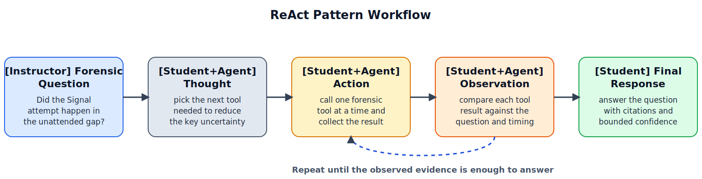

# Lab 3: ReAct Pattern for Incremental Communication Verification

Lab 3 applies the ReAct Pattern as a structured `thought -> action -> observation -> response` loop for a bounded forensic question. Students use a tool-enabled agent to decide what to inspect next, execute one tool call at a time, and stop only after the available evidence supports a careful answer. Unlike the Tool Use Pattern in Lab 2, which emphasizes selecting and executing appropriate tools, ReAct emphasizes using each observation to choose the next step in an explicit reasoning loop. The instructional emphasis is on transparent tool use, incremental verification, and final answers that stay within what the observed evidence supports.

## Lab-Specific Environment

Before running `03a_memory_demo.ipynb`, `03b_lab_notebook.ipynb`, or `03c_react_assignment.ipynb`, create a lab-local `.env` in this folder:

```bash
cp .env.example .env
```

These notebooks read `MODEL` and `OLLAMA_BASE_URL` from `lab3_react_pattern/.env`, so you can change models here without affecting the other labs.

## Educational Objective

The objective of Lab 3 is to build students' ability to answer a narrow forensic question by alternating between reasoning, tool use, and observation review, while keeping each step visible and inspectable.

## Learning Outcomes

By the end of Lab 3, students will be able to:

1. Explain the roles of `thought`, `action`, `observation`, and `response` in a ReAct loop.
2. Choose an appropriate next tool call instead of guessing when evidence is missing.
3. Use tool results to refine the next step in a bounded forensic workflow.
4. Produce a final answer that cites the observed evidence and notes what remains unconfirmed.
5. Distinguish a ReAct loop from a broader planning workflow that involves larger task decomposition and replanning.

## Measurable Targets

1. At least 85% of students correctly describe the four stages of the ReAct loop.
2. At least 80% of submissions use tool calls that are relevant to the forensic question being asked.
3. At least 80% of submissions correctly use an observation from one step to justify the next step.
4. At least 85% of final submissions answer the communication-timing question with evidence-cited reasoning.
5. At least 80% of final submissions avoid claiming confirmed delivery when the artifacts show only an attempt or incomplete network evidence.

## Assessment Method

Student performance is scored with a shared rubric applied to the ReAct step log, tool-call justification notes, and final answer. The rubric uses a 0-4 scale per dimension (ReAct loop understanding, relevance of tool choice, observation use, final conclusion support, and explanation of uncertainty). Scores are aggregated at class level to evaluate attainment of the measurable targets.

## Instructional Flow and Guided Example

To illustrate the ReAct Pattern workflow and assessment logic, we include the following guided example. Read `02_case_overview.md` for the full case facts, acquisition details, and artifact list; the full lab uses the same mini-case with visible tool calls and observations.
Before applying ReAct to this forensic case, it helps to recall the general pattern: think about the next needed step, act through a tool, inspect the observation, and repeat until you can answer. Figure 1 shows that general ReAct Pattern.


*Figure 1. General ReAct Pattern: the model reasons about the next step, acts through a tool, observes the result, and repeats until it can answer. Temporary linked figure from Avi Chawla, [5 Agentic AI design patterns](https://www.dailydoseofds.com/p/5-agentic-ai-design-patterns/), published January 24, 2025. A local backup is saved under `references/dailydoseofds_5_agentic_patterns/` for later redraw work.*

In Figure 1, `Environment` means the external system or evidence source the agent interacts with through tools and observes results from; in this lab, that corresponds to the forensic artifacts being inspected.

In this lab, that same pattern is narrowed to a quick communication-verification question: did a Signal attachment attempt happen during a reported unattended interval? Students also inspect network restoration as supporting context so the final answer stays bounded to what the evidence shows, rather than overstating confirmed delivery. As shown in Figure 2, the lab progresses from the forensic question to tool-guided evidence checks and then to a final bounded answer.



*Figure 2. ReAct-pattern workflow for Lab 3: instructor incident question -> student/tool-enabled ReAct loop -> evidence observations -> final communication-timing answer.*

## ReAct Logic

Students are assessed on how clearly they use the loop, not on hidden model internals. In practice, students should follow this decision logic and justify each step with the observation it depends on:

1. Restate the forensic question before making a tool call.
2. Choose the next tool that reduces the most important uncertainty.
3. Record the observation from that tool call.
4. Decide whether another tool call is needed or whether the evidence is now sufficient.
5. Produce a final response only after the observed evidence supports the answer.

The agent acts as a bounded aid, not a decision authority: students remain responsible for accepting, rejecting, and justifying the final conclusion.

## Guided Example

In this lab, students review a short unattended-device interval. The key ReAct challenge is to answer a narrow timing question without skipping directly to a conclusion.

| Step | Tool Call | Observation | Why It Matters |
|---|---|---|---|
| 1 | check the incident window | staff observation marks the phone as unattended from `14:10:00 UTC` to `14:25:00 UTC` | defines the interval that later events must be compared against |
| 2 | check the messaging event | Signal attachment attempt recorded at `14:16:11 UTC` | shows a communication attempt inside the unattended interval |
| 3 | check the network restoration time | mobile data restored at `14:28:02 UTC` | shows connectivity returned after the unattended interval ended |
| 4 | produce the answer | attempted communication happened in the interval, but reconnection happened later | supports a bounded final answer without overstating successful delivery |

Student Draft v1:  
"There was a Signal event, so the message was sent during the unattended interval."

Student Final v2:  
"The artifacts show a Signal attachment attempt at `14:16:11 UTC`, which falls inside the unattended interval. Network records show the device reconnected at `14:28:02 UTC`, after the interval ended, so the current evidence supports an in-window attempt but does not confirm successful delivery before the interval ended."

This draft-to-revision contrast shows the ReAct Pattern objective: each next step should come from the last observation, and the final answer should remain bounded by what the tools actually returned.

In the actual lab, students analyze the staged mini-case package described in `02_case_overview.md`, with visible tool calls and manual observation logging before using the packaged `ReactAgent`. Before the forensic case notebook, students should open `03a_memory_demo.ipynb` to see how conversation history acts as short-term agent memory. Then students should open `03b_lab_notebook.ipynb`, restate the forensic question, walk through the manual ReAct loop one tool call at a time, and compare that process with the packaged agent. After the guided walkthrough, students should complete `03c_react_assignment.ipynb`, which keeps the same case and tools but removes the fixed tool order so students can justify the next step more independently. Required deliverables are a short ReAct step log, a final answer to the communication question, and a reflection that links claims to tool observations and limits.

Students should work through this lab in order: `01_instructions.md`, `02_case_overview.md`, `03a_memory_demo.ipynb`, `03b_lab_notebook.ipynb`, then `03c_react_assignment.ipynb`.

The staged artifact package in `data/` includes `artifact_manifest.json`, `incident_window.csv`, `messaging_events.csv`, `network_events.csv`, and `chain_of_custody.csv`.
