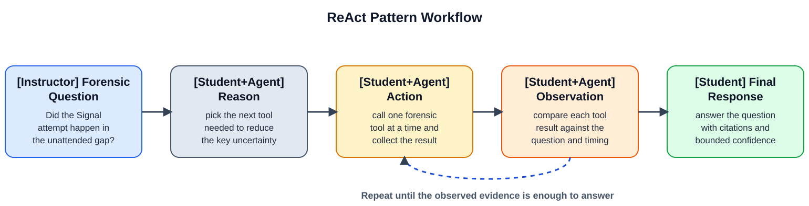

# Lab 3: ReAct Pattern for Incremental Communication Verification

## Purpose

Lab 3 introduces the ReAct Pattern as a structured `reason -> action -> observation -> response` loop for a bounded forensic question. Students inspect one piece of evidence at a time, use each observation to choose the next step, and stop only when the available evidence supports a careful answer.

Unlike Lab 2's Tool Use Pattern, which focuses on selecting and executing appropriate tools, ReAct makes the reasoning loop explicit. The instructional emphasis is on transparent tool use, incremental verification, and conclusions that stay within the observed evidence.

## Learning Outcomes

By the end of Lab 3, students will be able to:

1. Explain the roles of `reason`, `action`, `observation`, and `response` in a ReAct loop.
2. Choose a tool call that reduces the most important remaining uncertainty.
3. Use one tool result to justify the next step in a bounded forensic workflow.
4. Produce a final answer that cites observed evidence and states what remains unconfirmed.
5. Distinguish a ReAct loop from a planning workflow that uses broader task decomposition and replanning.

## The General ReAct Pattern

The animation below shows the general ReAct Pattern: reason about the next step, act through a tool, inspect the observation, and repeat until there is enough evidence to answer.


*Figure 1. General ReAct Pattern: the model reasons about the next step, acts through a tool, observes the result, and repeats until it can answer. Adapted from Avi Chawla, [5 Agentic AI design patterns](https://www.dailydoseofds.com/p/5-agentic-ai-design-patterns/).*

- **Query:** the question or task given to the agent.
- **LLM (Reason):** the model identifies the most important unanswered question and decides what information it needs next.
- **Tools:** the functions or systems the agent can use to obtain information.
- **Action:** the agent calls a tool with valid arguments.
- **Environment:** the external system or information source that receives the action.
- **Result:** the information the environment returns after that action.
- **LLM (Generate):** the model uses the returned result to prepare a response or decide whether another loop is needed.
- **Response:** the final answer returned to the user for review.

## The Case Scenario

This lab examines a practice case involving an Android phone that was left unattended. Your task is to determine whether someone tried to send an image through the Signal messaging app during that time.

The artifacts include a record of when the phone was unattended, a Signal activity record, and records showing when mobile data became available again. Together, they show that the phone attempted to communicate, but they do not prove that the file was successfully delivered. Use only these records to write a careful answer that clearly separates what the evidence shows from what remains unknown.

## The ReAct Workflow in This Lab

The Lab 3 workflow applies the general ReAct loop to the question of whether the phone tried to send an image through Signal while it was unattended. You first work through the loop manually, with visible tool calls and observations. You then compare that manual process with the packaged `ReactAgent`. The lab includes a short memory demonstration, a guided ReAct walkthrough, and an independent ReAct assignment.



*Figure 2. ReAct-pattern workflow for Lab 3: instructor incident question -> student/tool-enabled ReAct loop -> evidence observations -> final answer about whether the phone tried to send an image through Signal while it was unattended.*

**Figure 2, step by step:**

- **[Instructor] Forensic Question:** *Did the Signal attempt happen during the unattended gap?* The instructor provides this narrow question together with the staged evidence package.
- **[Student+Agent] Reason:** *Pick the next tool needed to reduce the key uncertainty.* Before acting, identify what you still need to know to answer the question.
- **[Student+Agent] Action:** *Call one forensic tool at a time and collect the result.* Select the tool most likely to reduce that uncertainty, then use valid arguments to call it.
- **[Student+Agent] Observation:** *Compare each tool result against the question and its timing.* Record what the result shows and decide whether another evidence check is needed.
- **[Student] Final Response:** *Answer the question with citations and bounded confidence.* Compare the claim with the observed artifacts, state any remaining limit, and decide whether the conclusion is appropriate.
- **Repeat:** *Continue until the observed evidence is enough to answer.* If an important uncertainty remains, return to Reason and choose the next evidence check; otherwise, provide the final response.

## ReAct Logic

Students are assessed on how clearly they use the loop, not on hidden model internals. In practice, follow this decision logic and justify each step with the observation it depends on:

1. Restate the forensic question before making a tool call.
2. Choose the next tool that reduces the most important uncertainty.
3. Record the observation from that tool call.
4. Decide whether another tool call is needed or whether the evidence is now sufficient.
5. Produce a final response only after the observed evidence supports the answer.

The agent is a bounded aid, not a decision authority. You remain responsible for accepting, rejecting, and justifying the final conclusion.

## Guided Example

In this lab, students review a short unattended-device interval. The key ReAct challenge is to answer a narrow timing question without skipping directly to a conclusion.

| Step | Tool Call | Observation | Why It Matters |
|---|---|---|---|
| 1 | check the incident window | staff observation marks the phone as unattended from `14:10:00 UTC` to `14:25:00 UTC` | defines the interval that later events must be compared against |
| 2 | check the messaging event | Signal attempt to send an image attachment recorded at `14:16:11 UTC` | shows a communication attempt inside the unattended interval |
| 3 | check the network restoration time | mobile data restored at `14:28:02 UTC` | shows connectivity returned after the unattended interval ended |
| 4 | produce the answer | an attempt to send an image through Signal happened in the interval, but reconnection happened later | supports a bounded final answer without overstating successful delivery |

Student Draft v1:  
"There was a Signal event, so the image was sent during the unattended interval."

Student Final v2:  
"The artifacts show an attempt to send an image through Signal at `14:16:11 UTC`, which falls inside the unattended interval. Network records show the device reconnected at `14:28:02 UTC`, after the interval ended, so the current evidence supports an in-window attempt but does not confirm successful delivery before the interval ended."

This contrast illustrates the ReAct Pattern objective: each next step should follow from the last observation, and the final answer should remain bounded by what the tools actually returned.

The staged artifact package in `data/` includes `artifact_manifest.json`, `incident_window.csv`, `messaging_events.csv`, `network_events.csv`, and `chain_of_custody.csv`.

## Lab-Specific Environment

Before running the Lab 3 notebooks, create a lab-local `.env` in this folder:

```bash
cp .env.example .env
```

On Windows, use the command for your terminal:

```powershell
# PowerShell
Copy-Item .env.example .env
```

```bat
:: Command Prompt
copy .env.example .env
```

These notebooks read `MODEL` and `OLLAMA_BASE_URL` from `lab3_react_pattern/.env`, so you can change models here without affecting the other labs.

## Next

Continue with [Lab 4: Planning Pattern](../lab4_planning_pattern/01_instructions.md).
