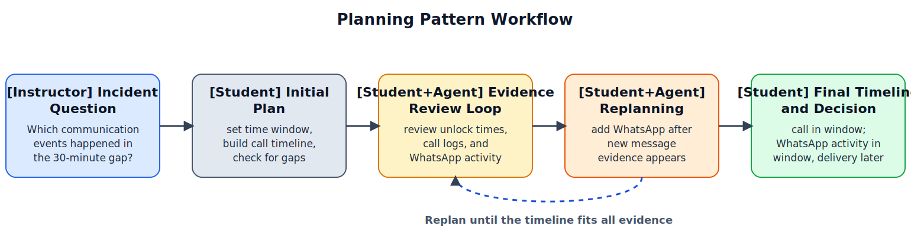

# Lab 4: Planning Pattern for Adaptive Timeline Reconstruction and Event Classification

Lab 4 applies the Planning Pattern as a structured workflow for breaking a timeline question into ordered steps. Students use an LLM-based planning agent to build plans, record observations as they work, and revise the plan when new evidence conflicts with earlier assumptions, while remaining responsible for the final interpretation and conclusion. The instructional emphasis is on clear sequencing, observation-driven revision, and evidence-based timeline reconstruction.

## Lab-Specific Environment

Before running `03_lab_notebook.ipynb`, create a lab-local `.env` in this folder:

```bash
cp .env.example .env
```

This notebook reads `MODEL` and `OLLAMA_BASE_URL` from `lab4_planning_pattern/.env`, so you can change models here without affecting the other labs.

## Educational Objective

The objective of Lab 4 is to build students' ability to create ordered investigation plans, update those plans when new observations appear, and produce an evidence-cited timeline conclusion about whether the key events occurred within the incident window, outside it, or remain unresolved.

## Learning Outcomes

By the end of Lab 4, students will be able to:

1. Break a case question into ordered subgoals.
2. Execute an investigation plan using repeated observation-and-update cycles.
3. Replan appropriately when observations invalidate prior assumptions.
4. Produce a final conclusion grounded in a clear, evidence-cited timeline.
5. Explain why a planning agent's proposed sequence failed or required revision when new observations exposed hidden assumptions, missing dependencies, or timing conflicts.

## Measurable Targets

1. At least 85% of students produce an initial plan containing required phases (scope definition, evidence collection, comparison, and decision).
2. At least 80% of submissions execute plan steps in a logical order with explicit observation updates after each major step.
3. At least 80% of submissions correctly perform at least one observation-driven replan when contradictory evidence appears.
4. At least 85% of final submissions reconstruct at least 90% of key timeline events in the shared scoring guide.
5. At least 80% of final submissions correctly classify whether the key event sequence occurred within the incident window, outside it, or remains unresolved using evidence-based justification.
6. At least 80% of submissions correctly explain at least one case in which the planning agent's initial suggestion was insufficient and required evidence-driven replanning.

## Assessment Method

Student performance is scored with a shared rubric applied to the planning log, observation log, and final report. The rubric uses a 0-4 scale per dimension (plan completeness, step order, replanning quality, diagnosis of planning-agent limits, and conclusion support). Scores are aggregated at class level to evaluate attainment of the measurable targets.

When staffing permits, a subset of submissions may be scored by two reviewers, with differences reconciled through a shared scoring guide. Lab-level reporting includes target attainment rates, timeline reconstruction accuracy, and common problems (missing dependencies, uncritical acceptance of agent plans, missing replanning, and unsupported conclusions).

## Instructional Flow and Guided Example

To illustrate the Planning Pattern workflow and assessment logic, we include the following guided example. Read `02_case_overview.md` for the full case facts, timeline, and artifact list; the full lab extends the same scenario with additional records and alternate decision points.
Before applying Planning to this forensic case, it helps to recall the general pattern: break a larger task into ordered steps, execute those steps, and revise the plan when new observations change what should happen next. Figure 1 shows that general Planning Pattern.


*Figure 1. General Planning Pattern: the model reasons through intermediate steps and updates its path toward a larger goal. Temporary linked figure from Avi Chawla, [5 Agentic AI design patterns](https://www.dailydoseofds.com/p/5-agentic-ai-design-patterns/), published January 24, 2025. A local backup is saved under `references/dailydoseofds_5_agentic_patterns/` for later redraw work.*

In this lab, that same pattern is narrowed to forensic timeline reconstruction, where students must plan, observe, and replan as new device records change the interpretation of the event sequence. As shown in Figure 2, the lab progresses from an incident question to initial planning, evidence review, observation-driven replanning, and a final timeline conclusion.



*Figure 2. Planning-pattern workflow for Lab 4: instructor incident question -> student initial plan -> student+agent evidence review loop -> student+agent replanning after new WhatsApp evidence -> student final timeline and timing decision.*

## Planning Logic

Students are assessed on how clearly they explain their planning and replanning, not on hidden model internals. In practice, students should follow this decision logic and justify each step with the evidence they need:

1. Define incident scope and time window before collection.
2. Break the case question into ordered subgoals.
3. Execute the next planned step and record observation updates.
4. Compare new observations against current assumptions and the working timeline.
5. Replan when observations conflict with assumptions or leave key gaps unresolved.
6. Finalize the timing conclusion only after the timeline and supporting observations are backed by enough evidence.

The agent acts as a planning aid, not a decision authority: students remain responsible for accepting, rejecting, and justifying those suggestions.

## Guided Example

In this lab, students reconstruct what happened during a missing-phone interval and decide which communication events fall inside the incident window. The key planning challenge is to revise an initial call-based timeline after WhatsApp and network evidence changes the interpretation of message delivery.

| Plan Step | New Observation | Required Plan Update | Why It Matters |
|---|---|---|---|
| Define incident period from phone unlock records | access period limited to `20:55-21:25 UTC` | keep all next steps inside this time range before looking outside it | narrows scope and avoids unnecessary data collection |
| Reconstruct the phone-call timeline | outgoing call to `+1-555-0184` logged at `21:08 UTC` for `42` seconds | place the confirmed call in the timeline and compare later records against it | establishes one known communication event inside the incident window |
| Check whether the first timeline is complete | no second call or SMS appears in the standard phone logs | keep the call event, but search for other communication activity near the same time | shows that call history alone may not capture the full sequence |
| Add WhatsApp activity after a new finding | WhatsApp chat opened at `21:12`; evidence shows a message with an image attachment was later deleted, with activity at `21:13` | extend the timeline to WhatsApp activity and check whether the network was available to send the message before `21:25` | introduces a second communication event that was not visible in the call logs |
| Replan around network status | device offline from `21:10-21:26`; mobile data restored at `21:27` | revise the timeline to separate in-window WhatsApp activity from any later delivery after reconnection | changes the timing conclusion for the WhatsApp event |

Student Draft v1:  
"Because there was a phone call at `21:08 UTC` and evidence of WhatsApp message activity near `21:13 UTC`, conclude that both communications happened during the missing period."

Student Final v2:  
"Start by fixing the incident window. The `21:08 UTC` phone call clearly falls inside it. The WhatsApp records show chat activity at `21:13 UTC`, but network records show the device was offline until `21:26 UTC`. Revise the timeline to show a phone call and WhatsApp activity during the incident window, with any actual WhatsApp delivery occurring only after the phone reconnected."

This plan-to-replan contrast shows the Planning Pattern objective: each timeline update must follow explicit observation-driven plan revision.

This example shows the main learning point: Planning Pattern instruction requires students to treat timeline reconstruction as an adaptive sequence rather than a fixed checklist.

In the actual lab, students analyze the full staged case package described in `02_case_overview.md`, with additional decision branches and conflicting observations. Required deliverables are an initial investigation plan, an observation-linked replanning log, a final report with the reconstructed timeline, and a table linking claims to evidence.

Students should work through this lab in order: `01_instructions.md`, `02_case_overview.md`, then `03_lab_notebook.ipynb`.

The staged artifact package in `data/` includes `artifact_manifest.json`, `unlock_events.csv`, `call_log.csv`, `whatsapp_events.csv`, `network_status.csv`, and `chain_of_custody.csv`.
