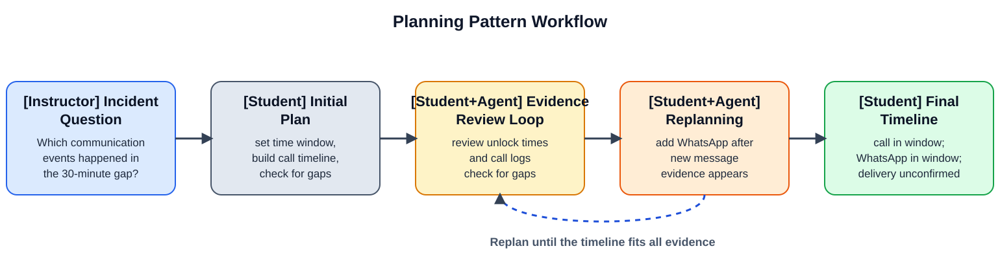

# Lab 4: Planning Pattern for Adaptive Timeline Reconstruction

## Purpose

Lab 4 introduces the Planning Pattern: create an ordered investigation plan, carry out its next step, compare the new observation with the current plan, and revise the path when needed. Students use this pattern to reconstruct a mobile-device timeline without treating the first plausible sequence as final.

Unlike Lab 3's ReAct Pattern, which focuses on selecting the next evidence check one step at a time, planning starts with a broader sequence of subgoals. The instructional emphasis is on clear ordering, observation-driven replanning, and conclusions that remain within the available evidence.

## Why a Planner Matters

A planner is useful when a larger task has several connected steps rather than one next action. It turns the larger goal into an ordered path, so later steps use the information gathered earlier.

For example, an initial birthday-party plan might be:

`estimate guests -> choose date -> reserve room -> order food`

If the room is unavailable on the chosen date, the planner revises the remaining steps:

`check availability -> choose another date or room -> update the guest count -> order food`

This prevents an assistant from ordering food before it knows how many people can attend.

**When to use each pattern:**

- **Use Planning** when a task needs a multi-step strategy: several dependent actions, an overall order, and possible revision as new information appears. Organizing a party is a planning task.
- **Use ReAct** when a task can proceed one step at a time: choose the next action, inspect the result, and then decide whether another action is needed. Checking a store's closing time is a ReAct task.
- **Use both together** when a larger plan contains evidence-gathering steps. A planner can choose the overall sequence, while ReAct carries out each step and returns observations for the next planning decision.

## Learning Outcomes

By the end of Lab 4, students will be able to:

1. Break a forensic timeline question into ordered subgoals.
2. Build and carry out an initial investigation plan using the available records.
3. Compare a new observation with the plan's assumptions and identify when the plan must change.
4. Reconstruct a timeline that distinguishes activity during the incident window from later activity.
5. Produce an evidence-cited conclusion that states what remains unresolved.
6. Explain why an agent's suggested plan is an aid to review, not a final investigative decision.

## The General Planning Pattern

The Planning Pattern begins with a larger question rather than a single tool call. A planner proposes an ordered path, evidence-gathering steps produce observations, and those observations may require the plan to change before a final response is written.


*Figure 1. General Planning Pattern: a planner breaks a larger goal into steps, uses new results to update the path, and works toward a final response. Adapted from Avi Chawla, [5 Agentic AI design patterns](https://www.dailydoseofds.com/p/5-agentic-ai-design-patterns/).*

- **Question:** States the larger task that needs a sequence of evidence checks.
- **Planner:** Breaks that task into ordered subgoals and identifies the next useful step.
- **Plan:** Records the current sequence, needed evidence, and conditions that would require a revision.
- **Execution:** Carries out the next evidence-gathering step, manually or through an approved tool-enabled agent.
- **Observation:** Records what the evidence shows and what uncertainty remains.
- **Replan:** Updates the sequence when an observation contradicts an assumption or reveals a missing dependency.
- **Response:** Gives a final, evidence-bounded conclusion once the remaining plan is sufficient.

## The Case Scenario

- **Situation:** A Google Pixel 8 was reported missing during evening field visits for a 30-minute interval.
- **Your task:** Reconstruct the communication timeline and determine which supported events occurred inside that interval.
- **Available records:** Device-unlock records, an outgoing call record, WhatsApp activity, and network-status records.
- **Evidence limit:** Do not assume an activity record confirms delivery; use the network-status record to determine what the available evidence supports.

Use only the staged records to build a careful timeline, identify what remains unknown, and revise the plan when the network record changes the meaning of the earlier WhatsApp finding.

## The Planning Workflow in This Lab

Lab 4 applies the general Planning Pattern to reconstructing this timeline. You first make the planning and replanning steps visible with a partial evidence bundle. You then compare that process with `PlanningAgent`, extend it to a planner-plus-`ReactAgent` workflow, and optionally view a bounded automatic version.



*Figure 2. Planning-pattern workflow for Lab 4: an incident question leads to an initial plan, evidence review, replanning after new WhatsApp evidence, and a final timing decision.*

**Figure 2, step by step:**

- **[Instructor] Incident Question:** *Which communication events happened in the 30-minute gap?* Start with this narrow timing question and the staged evidence package.
- **[Student] Initial Plan:** *Set the time window, build the call timeline, and check for gaps.* Record the order of evidence checks and the assumptions that later evidence could challenge.
- **[Student+Agent] Evidence Review Loop:** *Review unlock times, call logs, and WhatsApp activity.* Add each supported observation to the working timeline instead of treating a single record as the complete answer.
- **[Student+Agent] Replanning:** *Add WhatsApp after new message evidence appears.* When a new observation reveals a gap or conflict, update the remaining steps before drawing a conclusion.
- **[Student] Final Timeline and Decision:** *Call in window; WhatsApp activity in window, delivery later.* State the supported timing of the call and WhatsApp activity, but do not claim confirmed delivery; the later network restoration only shows that connectivity returned after the incident window.
- **Repeat:** *Replan until the timeline fits all evidence.* If an important uncertainty remains, return to the current plan and choose the next needed check; otherwise, write the final response.

## Planning Logic

Students are assessed on how clearly they plan and replan, not on hidden model internals. In practice, follow this decision logic and justify each change with the observation it depends on:

1. Define the incident scope and time window before collecting records.
2. Break the question into ordered subgoals, beginning with the most direct timeline evidence.
3. Carry out the next step and record the resulting observation.
4. Compare that observation with the current timeline and the plan's assumptions.
5. Replan when an observation conflicts with an assumption or leaves a key gap unresolved.
6. Produce the final timing conclusion only when the observed evidence supports it and the remaining uncertainty is stated.

The agent is a planning aid, not a decision authority. You remain responsible for accepting, rejecting, and justifying the final conclusion.

## Guided Example

In this lab, students reconstruct activity during a missing-phone interval. The planning challenge is to revise an initial call-based timeline when WhatsApp and network evidence reveal that a delivery claim would go beyond the available records.

| Plan Step | New Observation | Required Plan Update | Why It Matters |
|---|---|---|---|
| Define the incident period from phone-unlock records | device access period is `20:55-21:25 UTC` | keep the initial timeline inside this time range before investigating outside it | narrows the question and avoids unnecessary collection |
| Reconstruct the phone-call timeline | outgoing call to `+1-555-0184` recorded at `21:08 UTC` for `42` seconds | place the confirmed call in the timeline and compare later records against it | establishes one supported communication event inside the incident window |
| Check whether the first timeline is complete | no second call or SMS appears in the standard phone logs | keep the call event, but check for other communication activity near the same time | shows that call history alone may not capture the full sequence |
| Add WhatsApp activity after a new finding | WhatsApp chat opened at `21:12`; an image-attachment message event was recorded at `21:13` | extend the timeline to include WhatsApp activity and check the network context | introduces a second communication event not visible in the call log |
| Replan around network status | device offline from `21:10-21:26`; mobile data restored at `21:27` | revise the conclusion to separate in-window WhatsApp activity from unconfirmed delivery | prevents a delivery claim that the available records do not establish |

Student Draft v1:  
"Because there was a phone call at `21:08 UTC` and WhatsApp message activity near `21:13 UTC`, conclude that both communications were completed during the missing period."

Student Final v2:  
"The records show an outgoing phone call at `21:08 UTC` and WhatsApp activity associated with an image attachment at `21:13 UTC`, both within the `20:55-21:25 UTC` incident window. Network records show the device was offline from `21:10` until `21:26 UTC`, so the available evidence does not confirm that the attachment was delivered during the incident window."

This contrast shows the Planning Pattern objective: revise the investigation path and the final conclusion when new evidence changes what the earlier plan could support.

## Workflow in This Lab

1. **Review the case.** Read [02_case_overview.md](02_case_overview.md) to understand the incident window, available artifacts, and evidence limits.
2. **Make planning visible.** Complete [03a_lab_notebook.ipynb](03a_lab_notebook.ipynb). You build an initial plan from partial evidence, receive the withheld network observation, revise the plan, and compare the manual process with `PlanningAgent`.
3. **Extend planning to evidence execution.** Complete [03b_lab_planner_react_workflow.ipynb](03b_lab_planner_react_workflow.ipynb). `PlanningAgent` selects the next evidence-gathering task, and `ReactAgent` returns the observation used for the next planning decision.
4. **Explore bounded automation (optional).** Run [03c_automatic_planner_react_demo.ipynb](03c_automatic_planner_react_demo.ipynb) to see the same planner-to-`ReactAgent` loop run for a limited number of rounds. Its exact sequence may vary by model.

## Lab-Specific Environment

Before running the Lab 4 notebooks, create a lab-local `.env` file:

```bash
cp .env.example .env
```

On Windows, use the command for your terminal:

```powershell
# PowerShell
Copy-Item .env.example .env
```

```bat
:: Command Prompt
copy .env.example .env
```

The notebooks read `MODEL` and `OLLAMA_BASE_URL` from `lab4_planning_pattern/.env`, so you can change these settings without affecting the other labs.

## Next

Continue with [Lab 5: Multiagent Pattern](../lab5_multiagent_pattern/01_instructions.md).
