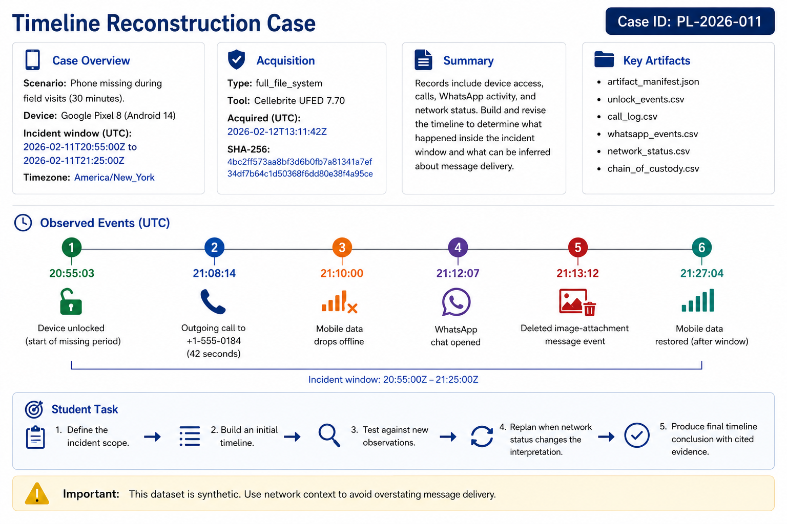

# Timeline Reconstruction Case

*Figure 1. Planning case overview: the incident context, key event sequence, available artifacts, and evidence limit for the Lab 4 timeline-reconstruction exercise.*

## Case Overview
- Case ID: `PL-2026-011`
- Scenario: Mobile-phone access and communication timing review after a phone went missing during field visits.
- Device: Google Pixel 8 (`Android 14`)
- Incident window (UTC): `2026-02-11T20:55:00Z` to `2026-02-11T21:25:00Z`
- Analysis timezone: `America/New_York`

## Acquisition and Integrity
- Acquisition type: `full_file_system`
- Acquisition tool: `Cellebrite UFED 7.70`
- Acquisition timestamp (UTC): `2026-02-12T13:11:42Z`
- Original image SHA-256:
  - `4bc2ff573aa8bf3d6b0fb7a81341a7ef34df7b64c1d50368f6dd80e38f4a95ce`

## Narrative Summary
A state benefits caseworker reported that a phone was missing for 30 minutes during evening field visits. The staged artifact package includes device access records, a phone call log, WhatsApp activity, and network status changes. Students must reconstruct the sequence of events, decide which actions happened inside the incident window, and revise the timeline when network evidence changes the interpretation of message delivery.

## Key Observed Event Sequence (UTC)
1. `20:55:03` - device unlocked at the start of the missing period
2. `21:08:14` - outgoing call to `+1-555-0184` lasts `42` seconds
3. `21:10:00` - mobile data drops offline
4. `21:12:07` - WhatsApp chat opened
5. `21:13:12` - deleted image-attachment message event recorded
6. `21:27:04` - mobile data restored after the incident window

## Artifact Files
- `artifact_manifest.json`: identifies the case and device, gives the acquisition context, and lists the files in the staged evidence package.
- `unlock_events.csv`: records when the phone was unlocked or locked. Use it to establish device-access timing during the missing period.
- `call_log.csv`: records the time, direction, number, duration, and type of each phone call. Use it to place the outgoing call in the timeline.
- `whatsapp_events.csv`: records WhatsApp actions, including opening a chat, deleting a message, and creating an image-attachment record. Use it to reconstruct app activity.
- `network_status.csv`: records time ranges when the phone was online or offline. Use it to interpret what the messaging records can—and cannot—show about delivery.
- `chain_of_custody.csv`: records acquisition, hash verification, and later handling of the evidence, helping document its integrity.

## Intended Educational Use
This dataset is synthetic and designed to demonstrate a planning and replanning workflow:
- define the incident scope
- build an initial timeline from the most direct records
- test the timeline against newly discovered observations
- replan when network status changes the timing interpretation
- produce a final timeline conclusion with cited evidence
