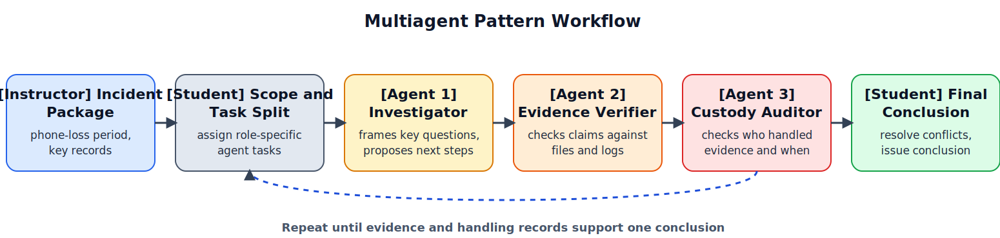

# Lab 5: Multiagent Pattern for Evidence Verification and Chain-of-Custody Analysis

Lab 5 applies the Multiagent Pattern as a structured workflow for evidence verification and chain-of-custody review in mobile forensics. Here, chain of custody means the record of who handled the evidence and when. Students use three LLM-based agents with distinct roles: an investigation agent, an evidence-verification agent, and a chain-of-custody auditing agent. They compare agent outputs, resolve disagreements, and issue final evidence-based conclusions. The instructional emphasis is on clear role boundaries, cross-checking, and reasoning that accounts for how evidence was handled.

## Lab-Specific Environment

Before running `03_lab_notebook.ipynb`, create a lab-local `.env` in this folder:

```bash
cp .env.example .env
```

This notebook reads `MODEL` and `OLLAMA_BASE_URL` from `lab5_multiagent_pattern/.env`, so you can change models here without affecting the other labs.

## Educational Objective

The objective of Lab 5 is to build students' ability to assign role-specific tasks, reconcile conflicting agent outputs, and produce an evidence-based conclusion about whether a file was transmitted (confirmed, likely, or unconfirmed), together with a plain-language explanation of whether the evidence-handling record is complete enough to trust that conclusion.

## Learning Outcomes

By the end of Lab 5, students will be able to:

1. Assign investigation subtasks to specialized agents with clear role boundaries.
2. Compare and reconcile conflicting outputs from the investigation, evidence-verification, and custody-auditing agents.
3. Evaluate whether the record of who handled the evidence and when supports or weakens confidence in a conclusion.
4. Produce a final case conclusion grounded in both technical evidence and the completeness of the evidence-handling record.
5. Explain whether disagreement across agents reflects missing evidence, prompt or role-boundary limits, or an unsupported inference by one of the agents.

## Measurable Targets

1. At least 85% of students use all three required agent roles with role-appropriate prompts.
2. At least 80% of submissions identify and resolve at least one conflict between agent outputs.
3. At least 85% of final submissions include a complete evidence-handling timeline with required transfer checks.
4. At least 80% of final submissions correctly classify the suspected file transmission as confirmed, likely, or unconfirmed using the shared scoring guide.
5. At least 85% of final submissions include specific evidence from files or logs and references to the evidence-handling record for each major claim.
6. At least 80% of submissions correctly diagnose at least one agent disagreement or failure mode using the role definitions and evidence from files, logs, or the evidence-handling record.

## Assessment Method

Student performance is scored with a shared rubric applied to a multiagent coordination log, conflict-resolution notes, and a final report. The rubric uses a 0-4 scale per dimension (role assignment quality, cross-agent checking quality, diagnosis of agent disagreement, analysis of the evidence-handling record, and conclusion support). Scores are aggregated at class level to evaluate attainment of the measurable targets.

When staffing permits, a subset of submissions may be scored by two reviewers, with differences reconciled through a shared scoring guide. Lab-level reporting includes target attainment rates, accuracy in identifying evidence-handling gaps, and common problems (role confusion, misdiagnosed agent conflict, unresolved agent conflict, unexplained record gaps, and unsupported conclusions).

## Instructional Flow and Guided Example

To illustrate the Multiagent Pattern workflow and assessment logic, we include the following guided example. Read `02_case_overview.md` for the full case facts, acquisition details, and artifact list; the full lab extends the same scenario with additional records and disagreement points.
Before applying Multiagent coordination to this forensic case, it helps to recall the general pattern: multiple specialized agents handle different subtasks, and their outputs are combined to support a final result. Figure 1 shows that general Multiagent Pattern.


*Figure 1. General Multiagent Pattern: specialized agents divide work across roles and contribute to a combined output. Temporary linked figure from Avi Chawla, [5 Agentic AI design patterns](https://www.dailydoseofds.com/p/5-agentic-ai-design-patterns/), published January 24, 2025. A local backup is saved under `references/dailydoseofds_5_agentic_patterns/` for later redraw work.*

In this lab, that same pattern is narrowed to forensic verification, where students compare outputs from specialized roles and resolve disagreements before reaching a final conclusion. As shown in Figure 2, the lab progresses from the incident package to student task assignment, multiagent checks, conflict resolution, and a final case conclusion.



*Figure 2. Multiagent-pattern workflow for Lab 5: instructor incident package -> student task split -> multiagent checks (investigation agent, evidence-verification agent, custody-auditing agent) -> student conflict resolution -> final case conclusion.*

## Multiagent Coordination Logic

Students are assessed on how clearly they explain coordination and conflict resolution, not on hidden model internals. In practice, students should follow this decision logic and justify each step with the evidence they need and the handling checks they perform:

1. Define the case question and scope before assigning agent tasks.
2. Use the investigation agent to frame case hypotheses and propose an ordered investigation sequence.
3. Use the evidence-verification agent to test each claim against specific files and logs.
4. Use the custody-auditing agent to check who handled the evidence, when they handled it, and whether each transfer is documented.
5. Resolve disagreements across agents with explicit evidence from files and logs and references to the evidence-handling record.
6. Finalize the case conclusion only after both the transmission evidence and the evidence-handling record are reviewed.

The agents act as specialized aids, not decision authorities: students remain responsible for accepting, rejecting, and justifying those suggestions.

## Guided Example

In this lab, students assess whether `patients_contacts.png` was transmitted during an unattended interval and whether a custody gap weakens confidence in that conclusion. The key multiagent task is to reconcile technical transmission evidence with evidence-handling concerns before making a final judgment.

| Checkpoint | Evidence Update | Agent Feedback | Student Action |
|---|---|---|---|
| Define case scope | phone lock and unlock logs set the incident period to `18:35-19:10 UTC` | investigation agent recommends checking file creation, transfer evidence, and the evidence-handling record in that order | accept the sequence and begin step-by-step checks |
| Verify transmission signals | phone media records show `patients_contacts.png` created at `18:44`; a messaging record shows an attach attempt at `18:45` | evidence-verification agent marks transmission as possible, not confirmed | keep confidence below confirmed and request confirmation of transfer |
| Validate transfer completion | network records show the upload started but there is no record that it finished | evidence-verification agent marks transmission as likely, not confirmed | revise the conclusion to likely and continue checks |
| Check evidence-handling record | the evidence log is missing documentation for one transfer between analysts | custody-auditing agent flags a gap in the evidence-handling record that weakens final confidence | keep the final conclusion unconfirmed until the missing transfer is explained |

Student Draft v1:  
"The file was transmitted because the file was created and an upload started."

Student Final v2:  
"The file record and upload attempt indicate likely transmission, but completion is not confirmed. Because one transfer in the evidence-handling record is not documented, the final conclusion remains unconfirmed until that gap is explained."

This draft-to-revision contrast shows the Multiagent Pattern objective: students must reconcile confidence in the transmission evidence with confidence in the evidence-handling record before issuing a final conclusion.

This example shows the main learning point: Multiagent Pattern instruction requires explicit role coordination and evidence-based conflict resolution rather than reliance on a single role or a single signal.

In the actual lab, students analyze the full staged case package described in `02_case_overview.md`, with additional agent disagreements and evidence-handling gaps. Required deliverables are a multiagent coordination log, conflict-resolution notes, an evidence-handling timeline, a final report, and a table linking claims to evidence.

Students should work through this lab in order: `01_instructions.md`, `02_case_overview.md`, then `03_lab_notebook.ipynb`.

The staged artifact package in `data/` includes `artifact_manifest.json`, `device_state.csv`, `file_events.csv`, `messaging_events.csv`, `network_events.csv`, and `chain_of_custody.csv`.
