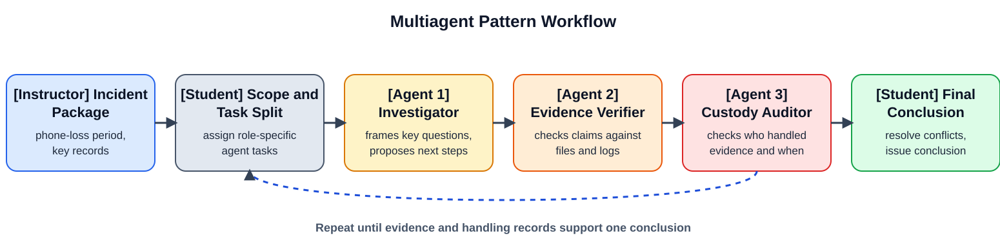

# Lab 5: Multiagent Pattern for Evidence Verification and Chain-of-Custody Analysis

## Purpose

Lab 5 introduces the Multiagent Pattern: several specialized agents contribute different kinds of analysis to one larger task. In this mobile-forensics case, students use an investigation agent, an evidence-verification agent, and a custody-auditing agent. They compare the agents' outputs, resolve disagreements with the records, and write one careful final conclusion.

Unlike Lab 4's Planning Pattern, which organizes and revises a sequence of evidence checks, the Multiagent Pattern divides related work among roles with clear responsibilities. The instructional emphasis is on role boundaries, cross-checking, and reasoning that accounts for both technical evidence and how that evidence was handled.

## Learning Outcomes

By the end of Lab 5, students will be able to:

1. Assign related forensic subtasks to specialized agents with clear role boundaries.
2. Explain how earlier agent outputs become context for later agents in a multiagent workflow.
3. Compare and reconcile conflicting outputs from investigation, evidence-verification, and custody-auditing roles.
4. Evaluate whether the evidence-handling record supports or weakens confidence in a technical conclusion.
5. Produce an evidence-cited conclusion that labels a suspected file transmission as `confirmed`, `likely`, or `unconfirmed` and states the remaining uncertainty.

## The General Multiagent Pattern

The Multiagent Pattern assigns different parts of a larger task to specialized agents. Each role contributes a focused result, and later roles can use earlier results as context. Figure 1 shows this general idea with a non-forensic software-development team before the lab applies the pattern to forensic evidence.

Use the Multiagent Pattern when a task benefits from distinct expertise, independent checks, or a final synthesis of several related findings.


*Figure 1. General Multiagent Pattern: a user request is divided across a PM agent, DevOps agent, tech lead agent, and SDE agent. Adapted from Avi Chawla, [5 Agentic AI design patterns](https://www.dailydoseofds.com/p/5-agentic-ai-design-patterns/).*

- **User:** supplies the overall request or problem to solve.
- **PM agent:** breaks that request into smaller tasks and coordinates who should address them.
- **DevOps agent and tech lead agent:** contribute different specialist perspectives. One focuses on operational or deployment concerns; the other focuses on technical design and implementation choices.
- **SDE agent:** uses the coordinated task information and specialist input to produce the implementation or final work product.
- **Arrows between roles:** show that agents can pass tasks, context, and findings to one another. The exact direction and order depend on the problem; the point is that the team combines specialized work instead of asking one agent to do everything.

## The Case Scenario

A public-health outreach phone was left unattended during a vaccination event. Investigators must determine whether `patients_contacts.png`, a file containing patient-related information, was transmitted from the phone and whether a gap in the chain-of-custody record weakens confidence in that conclusion.

The incident window is `18:35-19:10 UTC`. The records show that the file was created at `18:44`, a messaging app recorded an attachment attempt at `18:45`, and network upload activity began shortly afterward. They do not show that the upload finished. The chain-of-custody record also omits one transfer between evidence handlers.

**Key question:** What is the most evidence-supported conclusion about whether `patients_contacts.png` was transmitted?

**Supporting questions:**

1. Should the conclusion be labeled `confirmed`, `likely`, or `unconfirmed`?
2. How does the missing chain-of-custody transfer affect confidence in that conclusion?

Use only the staged records. Do not identify a suspect or infer intent. A missing custody handoff is an evidence-handling issue; it is not proof that the phone did or did not complete the transmission.

## The Multiagent Workflow in This Lab

Figure 2 shows the Lab 5 forensic workflow: specialized agents examine the case from different perspectives, students compare their findings, and the final conclusion reflects both the technical evidence and the evidence-handling record.



*Figure 2. Multiagent-pattern workflow for Lab 5: incident package -> student task split -> investigator -> evidence verifier -> custody auditor -> student final conclusion.*

Read Figure 2 from left to right:

1. **Start with the case question.** The instructor provides the incident package and asks whether `patients_contacts.png` was transmitted, which confidence label the evidence supports, and whether the custody gap weakens that conclusion.
2. **Divide the review.** The student sets the evidence boundaries and gives each agent one role-specific task instead of asking one agent to answer the entire case.
3. **Build the technical account.** `InvestigationAgent` organizes the timeline and identifies the transmission claim that needs testing.
4. **Test that claim.** `EvidenceVerificationAgent` compares the claim with the files and logs, separating an upload attempt from confirmed completion.
5. **Review evidence handling.** `CustodyAuditAgent` checks the chain-of-custody record and explains how an undocumented handoff affects confidence.
6. **Resolve and conclude.** The student compares the findings, resolves any disagreement with the records, and writes one evidence-bounded conclusion.

The dashed return arrow shows that the student revisits the scope and task split when the technical evidence or handling record is not yet sufficient to support one conclusion.

The roles are specialized aids, not decision authorities. You remain responsible for accepting, rejecting, and justifying the final conclusion.

## Multiagent Coordination Logic

Students are assessed on how clearly they coordinate and resolve disagreements, not on hidden model internals. Follow this decision logic and justify each step with the relevant evidence:

1. Define the case question, incident window, and evidence boundaries before assigning tasks.
2. Use `InvestigationAgent` to organize the technical timeline without treating an upload start as proof of completed transmission.
3. Use `EvidenceVerificationAgent` to test the technical claim against specific files and logs, especially the difference between `upload_started` and `upload_completed`.
4. Use `CustodyAuditAgent` to check who handled the evidence, when they handled it, and whether every transfer is documented.
5. Resolve any disagreement by returning to the records. Explain whether it reflects missing evidence, a role-boundary limit, or an unsupported inference.
6. Finalize the conclusion only after reviewing both the transmission evidence and the evidence-handling record. Keep the technical transmission question separate from the custody question.

## Lab-Specific Environment

Before running the Lab 5 notebooks, create a lab-local `.env` file:

```bash
cp .env.example .env
```

On Windows, use the command for your terminal:

```powershell
# PowerShell
Copy-Item .env.example .env
```

```bat
:: Command Prompt
copy .env.example .env
```

The notebooks read `MODEL` and `OLLAMA_BASE_URL` from `lab5_multiagent_pattern/.env`, so you can change these settings without affecting the other labs.

## Notebook Sequence

Complete the notebooks in this order. The warm-up makes the collaboration pattern visible before you apply it to forensic evidence.

| Notebook | What it teaches | What to notice |
|---|---|---|
| [03a_multiagent_warmup.ipynb](03a_multiagent_warmup.ipynb) | A plain-language warm-up to multiagent collaboration using `AudienceAgent`, `ProgramValueAgent`, and `OutreachAgent`. | Each role has a narrow responsibility, and its output becomes useful context for the next role. |
| [03b_multiagent_forensic_workflow.ipynb](03b_multiagent_forensic_workflow.ipynb) | The forensic application using `InvestigationAgent`, `EvidenceVerificationAgent`, and `CustodyAuditAgent`. | Later roles challenge and narrow earlier claims; the final conclusion combines technical evidence with custody review. |

Follow this sequence:

1. **Learn the collaboration pattern.** Complete [03a_multiagent_warmup.ipynb](03a_multiagent_warmup.ipynb). Observe how specialized roles pass their work forward instead of each attempting the entire task.
2. **Review the case.** Read [02_case_overview.md](02_case_overview.md) to understand the incident, artifact package, and evidence limits.
3. **Apply the pattern to the forensic case.** Complete [03b_multiagent_forensic_workflow.ipynb](03b_multiagent_forensic_workflow.ipynb). Compare each agent's output with the records, identify disagreements, and write the final conclusion yourself.

## Guided Example

In this lab, students assess whether `patients_contacts.png` was transmitted during the unattended interval and whether a custody gap weakens confidence in that conclusion. The key multiagent task is to reconcile technical transmission evidence with evidence-handling concerns before making a final judgment.

| Checkpoint | Evidence update | Agent feedback | Student action |
|---|---|---|---|
| Define case scope | phone lock and unlock logs set the incident period to `18:35-19:10 UTC` | `InvestigationAgent` recommends checking file creation, transfer evidence, and the evidence-handling record in that order | accept the sequence and begin step-by-step checks |
| Verify transmission signals | phone media records show `patients_contacts.png` created at `18:44`; a messaging record shows an attach attempt at `18:45` | `EvidenceVerificationAgent` marks transmission as possible, not confirmed | keep confidence below confirmed and request confirmation of transfer |
| Validate transfer completion | network records show the upload started but there is no record that it finished | `EvidenceVerificationAgent` marks transmission as likely, not confirmed | revise the conclusion to likely and continue checks |
| Check evidence-handling record | the evidence log is missing documentation for one transfer between analysts | `CustodyAuditAgent` flags a gap in the evidence-handling record that weakens final confidence | keep the transmission finding separate from the custody gap and state both limits in the final report |

Student Draft v1:  
"The file was transmitted because the file was created and an upload started."

Student Final v2:  
"The file record and upload attempt indicate likely transmission, but completion is not confirmed. One transfer in the evidence-handling record is not documented, which weakens confidence in the handling history. That custody gap does not itself establish whether the phone completed the transmission."

This contrast shows the Multiagent Pattern objective: use specialized roles to surface and test claims, then make the final conclusion only as strong as the records allow.

The staged artifact package in `data/` includes `artifact_manifest.json`, `device_state.csv`, `file_events.csv`, `messaging_events.csv`, `network_events.csv`, and `chain_of_custody.csv`.

## Course Completion

You have completed the five forensic pattern labs. Review the course guidance for submission or follow-up activities.
