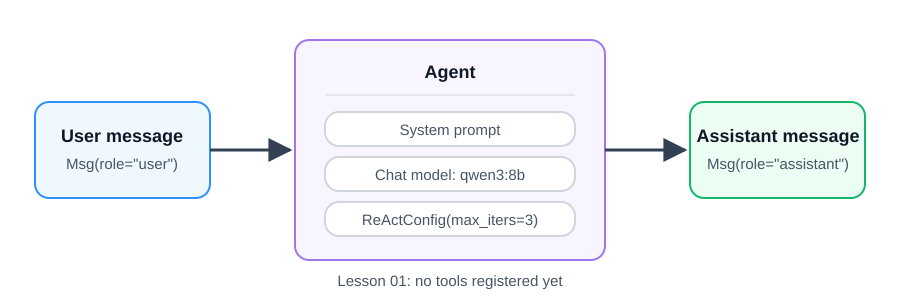

# A minimal ReAct agent

**Time:** 30–40 minutes  
**Outcome:** Create and run one AgentScope agent using the course Ollama model.

## Version note

This course uses AgentScope 2.x. In this version, the ReAct implementation is the unified `Agent` class configured with `ReActConfig`; `ReActAgent` is not an importable class. The agent still follows the same reasoning–acting design. With no tools registered yet, it makes a single model response. Lesson 02 adds an action through a Python tool.

## Before you start

Complete [Setup and first run](../00-setup-and-first-run/README.md). Then create this lesson’s local configuration:

    cp .env.example .env

The defaults match the other course labs:

    MODEL=qwen3:8b
    OLLAMA_BASE_URL=http://localhost:11434/v1

## Run the notebook

Open and run `01_minimal_react_agent.ipynb` from top to bottom. The final cell should return a short, evidence-aware analysis of the supplied case note.

## What to notice

The agent has four deliberate ingredients:

1. A name, used to identify its messages.
2. A system prompt, which sets its role and output constraints.
3. A chat model, configured for the course’s Ollama endpoint.
4. A `ReActConfig`, which caps the reasoning–acting loop at three iterations.

There are no tools yet. That is intentional: first establish the boundary between a model call and an agent object; next, add an action the agent can choose to invoke.

## Checkpoint

Before moving to Lesson 02, change the user’s case note and rerun the final cell. The response should preserve the requested distinction between observed evidence and inference.
