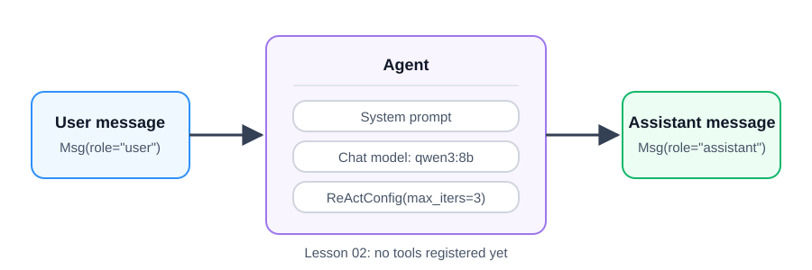

# Create your first AgentScope agent

**Time:** 30–40 minutes  
**Outcome:** Create and run one AgentScope agent using the course Ollama model.

## Background story

You are on a practice security team at a company. An employee’s work computer contacted an internet address many times, and you need a first review of the note. In this lesson, the agent can only read the note and explain what it says versus what it might mean. It cannot check any outside information yet. Lesson 03 gives it a small practice list to check before answering.

## Version note

This course uses AgentScope 2.x. In this version, use the `Agent` class with `ReActConfig`; `ReActAgent` is an older name you may see online. This lesson has no tools, so it shows one agent producing one response. Lesson 03 adds a Python tool and begins the ReAct cycle.

## Before you start

Complete [Setup and first run](../01-setup-and-first-run/README.md). Then copy this lesson’s local settings:

    cp .env.example .env

The defaults match the other course labs:

    MODEL=qwen3:8b
    OLLAMA_BASE_URL=http://localhost:11434/v1

## Run the notebook

Open and run `01_first_agentscope_agent.ipynb` from top to bottom. The final cell should return a short, careful response to the supplied note.

The note is about an employee’s work computer at a company.

## What to notice

The agent has four parts:

1. A name, used to identify its messages.
2. A starting instruction (called a system prompt), which tells it how to respond.
3. A language model, set to use the course’s Ollama address.
4. A `ReActConfig`, which limits the agent to three tries when it needs to use tools.

There are no tools yet. That is intentional: first see the difference between asking a model directly and asking an agent; next, add an action the agent can choose to take.

## Checkpoint

Before moving to Lesson 03, change the user’s note and rerun the final cell. The response should separate what the note says from what it might mean.
