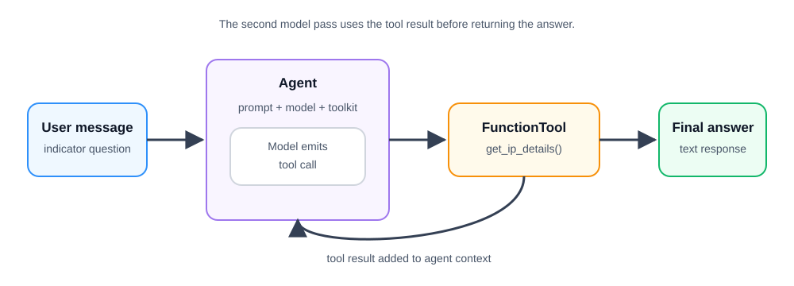

# Give the agent one Python tool

**Time:** 35–45 minutes  
**Outcome:** Give an AgentScope ReAct agent one safe Python tool and watch it ask for information, use the tool, and answer.

## Background story

You are a junior analyst on a practice security team at a company. One employee’s work computer contacted several internet addresses, and you need to prepare a short note. Before drawing a conclusion, the agent can check a small practice list for details about an IP address (an internet address). The results are clues, not proof by themselves.

### What the local results mean

| Local result | Meaning in this course |
| --- | --- |
| `known benign` | The practice list says this is expected activity; it is not a promise that the address is always safe. |
| `suspicious` | The practice list says a person should look into it; it is not proof that anything bad happened. |
| `no record` | The practice list has no entry; that does not mean the address is safe. |

## Before you start

Complete [Lesson 01](../01-first-agentscope-agent/README.md), then copy this lesson’s settings:

    cp .env.example .env

The default local model settings are:

    MODEL=qwen3:8b
    OLLAMA_BASE_URL=http://localhost:11434/v1

## Run the notebook

Open and run `01_python_tool.ipynb` from top to bottom.

The notebook turns `get_ip_details`, a small Python function that needs no internet connection, into an AgentScope tool. It tells the model the tool’s name, the information it needs, and what it does.

### New term: `Toolkit`

A `Toolkit` is the agent’s toolbox: it holds the functions the agent is allowed to use. In this lesson, it holds only `get_ip_details`.

1. `FunctionTool` turns the regular Python function into a tool the agent can use.
2. `Toolkit` stores that tool.
3. Passing `toolkit=toolkit` when creating the agent gives the agent access to the tool.

Without the `Toolkit`, the agent cannot see or call `get_ip_details`.

### Tool examples

| Input to `get_ip_details` | Returned output |
| --- | --- |
| `"198.51.100.10"` | A local `known benign` record. |
| `"192.0.2.44"` | A local `suspicious` record. |
| `"198.51.100.23"` | A result that says no local record was found. |

## What changes from Lesson 01?

The agent now has a `Toolkit` (a list of available tools) containing one function:

    User message → Agent reasons → model requests get_ip_details
                 → AgentScope runs the function → tool result
                 → Agent reasons again → final answer

AgentScope handles the handoff after the tool runs: it adds the tool result to the agent’s conversation, then asks the model to produce the final answer. The notebook does not show those internal steps yet; Lesson 03 makes them visible.

The tool is marked read-only: it only looks at a fixed list and changes nothing. AgentScope can run this kind of tool without asking first. Tools that change files, send messages, or run commands should ask for permission; a later lesson covers that.

## Checkpoint

Change the IP address in the user message to `198.51.100.23`. The final answer should say that the local dataset has no record for it rather than inventing details.
