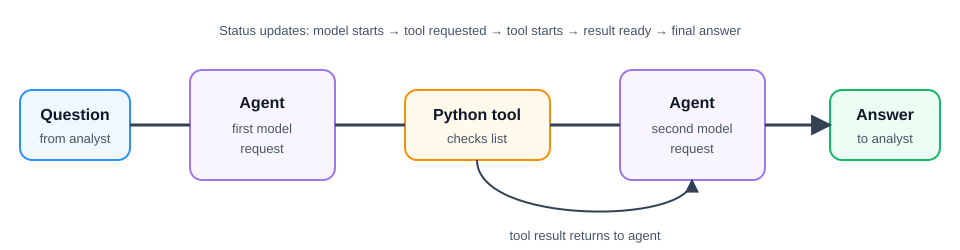

# Observe the ReAct cycle

**Time:** 40–50 minutes  
**Outcome:** See the steps an agent takes while it uses a Python tool.

## Background story

You are on a practice security team at a company. An employee’s work computer contacted an internet address, and you need a short note about it. The agent checks a small fixed practice list before answering. This list is built into the notebook: it does not search the internet or use real company data.

## New term: event stream

An event stream is a sequence of small status updates. Here, the updates show that the model starts, requests a tool, receives a tool result, and finishes an answer.

## This lab observes the built-in cycle

The notebook does not write its own Python while loop. Calling reply_stream starts AgentScope’s built-in ReAct cycle and gives the notebook each status update as it happens. The notebook prints those updates and counts the important ones at the end.

## How this differs from Lesson 03

Lesson 03 teaches **tool use**: students turn a Python function into a `FunctionTool`, put it in a `Toolkit`, and give that toolkit to an agent. They then make one high-level request and inspect the agent’s final answer. AgentScope runs the ReAct steps internally, so those intermediate steps are not shown.

Lesson 04 teaches **observability of that same tool-use cycle**. It uses one deliberately simple, read-only tool again, but it does not add a new tool or ask students to compare tools. Instead, students call `reply_stream` to watch and interpret the events that AgentScope emits: the initial model request, tool request, tool execution and result, second model request, and final answer. The learning goal is to understand and diagnose the agent’s execution trace, including when `max_iters` stops an unproductive loop.

In short: Lesson 03 is about giving an agent a tool and using it; Lesson 04 is about seeing what happens inside that agent run.

## How the cycle works

The loop has four steps:

1. The agent sends the employee's question and its instructions to the model.
2. The model asks to use get_ip_details because it needs information from the practice list.
3. AgentScope runs that Python function and gives its result back to the model.
4. The model uses the result to write the answer.

One tool is enough to show the cycle: model request → tool → model request → answer. More tools would teach a different topic—choosing or combining tools—which comes later.

The agent stops when the model returns an answer and does not ask for another tool. The setting max_iters=3 is a safety limit: it stops the agent if it keeps asking for tools instead of reaching an answer.

## Run the notebook

Copy the settings and run 01_watch_react_loop.ipynb:

    cp .env.example .env

## Two small functions

| Function | Input | Output |
| --- | --- | --- |
| get_ip_details | 192.0.2.44 | A practice-list record marked suspicious. |
| get_ip_details | 198.51.100.23 | A result saying no record was found. |
| describe_event | A tool-start update | Tool starts: get_ip_details. |

Each function documents its input, output, and the steps used to turn the input into the output.

## What to notice

When the model chooses the tool, the event summary should show two model requests, one tool request, one tool start, one tool result, and one finished answer. The first model request asks to use the tool. The tool returns information from the practice list. The second model request uses that information to write the final answer.

The notebook uses reply_stream to print the status updates as they arrive.

## Reading the event updates

`reply_stream` prints both the major stages of the ReAct cycle and smaller streaming updates. A `Start` event means that AgentScope or the model has begun a block of work; a `Delta` event means that another piece of that block has arrived; and an `End` event means that block is complete. The `Delta` updates do not mean the agent has made a new decision.

| Update | Meaning |
| --- | --- |
| `ReplyStartEvent` | The agent started handling the question. |
| `HintBlockEvent` | AgentScope emitted an internal guidance or status block for the run. It is framework bookkeeping, not a tool result or part of the final answer. |
| `ModelCallStartEvent` | AgentScope sent a request to the model. In the expected run, the first request chooses the tool and the second writes the answer. |
| `ThinkingBlockStartEvent`, `ThinkingBlockDeltaEvent`, `ThinkingBlockEndEvent` | The model began, streamed, and finished a reasoning block. These are streamed status details, not separate tool decisions. |
| `ToolCallStartEvent` | The model chose to call `get_ip_details`. This is a major ReAct decision. |
| `ToolCallDeltaEvent` | A piece of the tool-call details, such as an argument, arrived. |
| `ToolCallEndEvent` | The model finished specifying the tool call, so AgentScope can execute it. |
| `ModelCallEndEvent` | One request to the model completed. |
| `ToolResultStartEvent` | AgentScope began running `get_ip_details`. |
| `ToolResultTextDeltaEvent` | A piece of the tool result arrived. |
| `ToolResultEndEvent` | The tool result is complete and can be returned to the model. |
| `TextBlockStartEvent`, `TextBlockDeltaEvent`, `TextBlockEndEvent` | The model began, streamed, and finished the visible final-answer text. |
| `ReplyEndEvent` | The entire agent run is complete. |

For the standard one-tool run, the high-level sequence is:

    Agent starts → model chooses a tool → tool returns a result → model writes an answer → agent finishes
