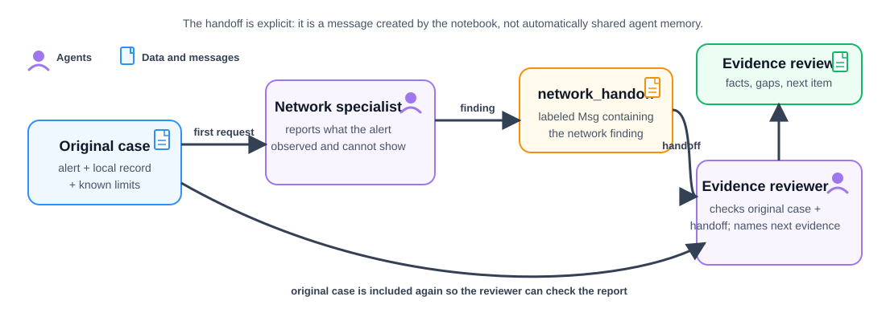

# Sequential agent handoff

**Time:** 40–50 minutes  
**Outcome:** Run two specialized agents in sequence and pass a labeled finding from the first agent to the second as explicit context.

## Background story

In Lesson 08, two specialists reviewed the same practice case independently. A real workflow often has an order: first establish what the network alert records, then ask an evidence reviewer what that finding supports and what should be collected next.

This lesson uses a sequential handoff. The first agent produces a short network finding. The notebook converts that finding into a structured message and places it in the second agent’s request.

The original case is sent to the network specialist first. Its finding becomes the explicit `network_handoff` message. The evidence reviewer receives both that message and the original case, so it can check the report against the source materials.

## Before you start

Complete [Lesson 08](../08-two-specialized-agents/README.md). Run the notebook from this folder so it loads the local `.env` file.

## Independent specialists versus a handoff

| Lesson 08: independent specialists | Lesson 09: sequential handoff |
| --- | --- |
| Both agents receive the original case separately | The second agent receives the original case and the first finding |
| Neither answer affects the other | The first finding becomes visible context for the second agent |
| Useful for comparison | Useful when one task must happen before the next |

The handoff is not automatic. AgentScope does not silently merge the agents’ conversations. The notebook deliberately creates the `Msg` containing the network finding, which makes the information flow reviewable.

## What the notebook demonstrates

1. Create a network specialist and an evidence-review specialist.
2. Ask the network specialist to summarize only the observed connection activity.
3. Convert its response into a labeled `network_handoff` message.
4. Ask the evidence reviewer to use the original case and that handoff to identify supported facts and next evidence.

## A handoff is evidence, not authority

The second agent should treat the first agent’s finding as a report to check against the original case, not as proof. This lab includes the original practice materials in the second request so the reviewer can preserve uncertainty and avoid inheriting unsupported claims.

## Checkpoint

Change the first specialist’s prompt to produce an overly confident conclusion, then observe whether the evidence reviewer flags that the supplied case does not justify it. This demonstrates why a downstream agent must still evaluate the original evidence.
