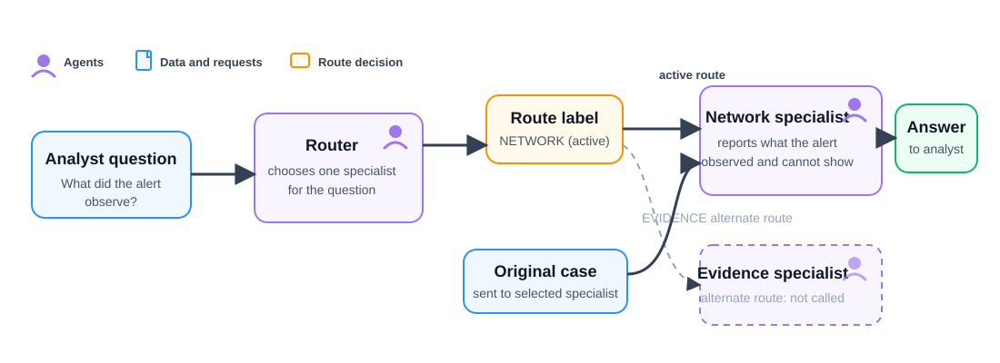

# Route a case question to one specialist

**Time:** 40–50 minutes  
**Outcome:** Use a small router agent to select one specialist for an analyst’s question and make the routing decision visible before the specialist runs.

## Background story

The earlier lessons either ran specialists independently (Lesson 08) or used a fixed order (Lesson 09). Some workflows need a different pattern: the next agent depends on the question. A question about observed connections should go to the network specialist; a question about evidence gaps should go to the evidence reviewer.

In this lab, the router is a narrowly scoped supervisor. It does not investigate the case or write the final analysis. It chooses a route label, and the notebook uses that label to call exactly one specialist.

## The three agents

All three are AgentScope `Agent` objects, but they have different responsibilities.

| Agent | Role | Output | Does not do |
| --- | --- | --- | --- |
| `case_router` | Reads the analyst’s question and chooses the appropriate expertise | Exactly `NETWORK` or `EVIDENCE` | Review the case or write the analyst answer |
| `network_specialist` | Explains what the network alert observed and what it cannot show | A focused network finding | Identify all evidence gaps or decide the next evidence to collect |
| `evidence_specialist` | Evaluates the evidence available for the question | Supported facts, missing evidence, and one next item to collect | Describe connection details beyond the available alert |

Purple boxes are agents. Blue boxes are source data or requests. The orange route label is the router’s decision. For the example question, the network path is active and the evidence-review path is not called.

## Before you start

Complete [Lesson 09](../09-sequential-handoff/README.md). Run the notebook from this folder so it loads the local `.env` file.

## Sequential handoff versus routing

| Lesson 09: sequential handoff | Lesson 10: router/supervisor |
| --- | --- |
| The same first stage always runs | The router chooses the next specialist |
| The first finding becomes input to a known second stage | The question determines which specialist receives the case |
| Best for a fixed investigation sequence | Best when incoming requests need different expertise |

## What the notebook demonstrates

1. Create a router, network specialist, and evidence specialist.
2. Ask the router to return exactly `NETWORK` or `EVIDENCE` for one analyst question.
3. Validate the returned label before choosing a specialist in Python.
4. Send the original case and question only to the selected specialist.

## Why validate the route?

A language-model response is text, even when the prompt requests a short label. The notebook checks the label against the two routes before dispatching. If the router returns something else, the notebook stops with a clear error rather than silently sending the case to the wrong agent.

## Checkpoint

Change the analyst question to: “What evidence should we collect before reaching a conclusion?” Confirm that the router selects `EVIDENCE`, the evidence specialist runs, and the network specialist is not called.
