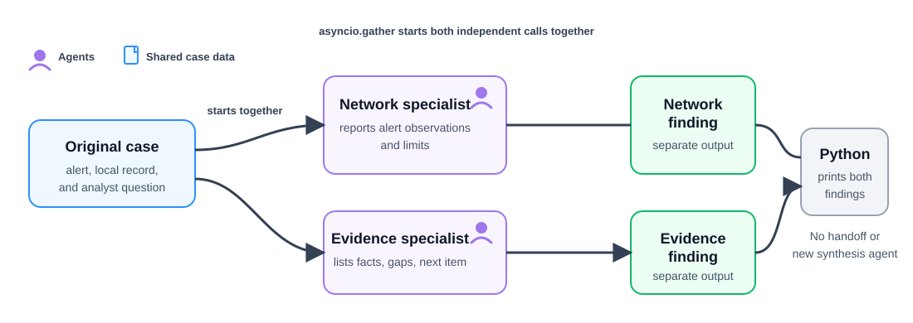

# Run independent specialists in parallel

**Time:** 40–50 minutes  
**Outcome:** Start independent specialist calls together with `asyncio.gather`, then compare their separate findings.

## Background story

Lesson 09 used a fixed sequence because the second stage needed the first stage’s finding. In contrast, a network review and an evidence review can begin from the same original case without waiting for one another. That makes them candidates for parallel execution.

This lab starts both specialists together. It does not give one specialist’s answer to the other, and it does not ask a third agent to combine their findings.

Purple boxes are agents. Blue boxes are the shared case data. The two purple paths start together and finish as two separate findings; the final comparison is ordinary Python output, not a new agent.

## Before you start

Complete [Lesson 10](../10-router-supervisor/README.md). Run the notebook from this folder so it loads the local `.env` file.

## Sequential versus parallel work

| Sequential handoff | Parallel specialists in this lab |
| --- | --- |
| A later stage needs an earlier result | Each task has all needed inputs at the start |
| One call waits for the prior call | `asyncio.gather` schedules both calls together |
| Useful for dependent steps | Useful for independent reviews |

Do not parallelize tasks that need one another’s results. Doing so would remove the information required for the later task.

## What `asyncio.gather` means here

`asyncio.gather(...)` waits for several asynchronous operations together. It lets the notebook begin both network requests before waiting for either final response.

It does **not** guarantee a shorter wall-clock time. A local model server, available hardware, or request limits may still serialize work. The notebook prints elapsed time so students can observe their own environment rather than assuming a speedup.

## What the notebook demonstrates

1. Create two independent specialists.
2. Build a separate request message for each agent from the same practice case.
3. Start both `reply()` calls with `asyncio.gather`.
4. Print the elapsed time and both labeled findings.

## Checkpoint

Temporarily replace `asyncio.gather(...)` with two `await` statements, one after the other. Compare the elapsed time and restore the parallel version. The answers may be similar; the difference is the scheduling pattern.
