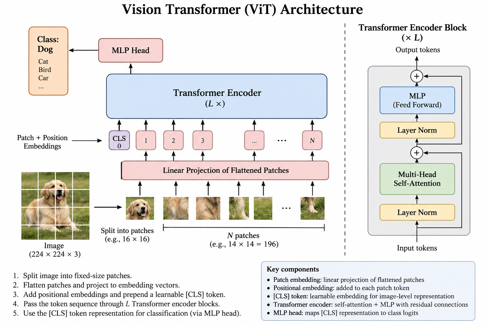

# Optional Supplement 01 Reading: Vision Transformer Foundations

A Vision Transformer (`ViT`) applies the Transformer encoder architecture to images. Instead of reading word or subword tokens, it turns small regions of an image into a sequence of patch tokens. The Transformer processes those tokens and can use the resulting representation for a task such as image classification.

This reading focuses on the original, teaching-friendly ViT classification pipeline. Modern vision and multimodal systems may use different image encoders, training objectives, or output heads.

The accompanying [tiny ViT notebook](03_tiny_vit_digits_demo.ipynb) turns these ideas into a runnable handwritten-`3`-versus-`8` example using a small, balanced subset of MNIST.

## 1. From an Image to Patches

A normal digital image is a grid of pixel values. A ViT first divides that grid into fixed-size, non-overlapping patches. For example, dividing a `224 × 224` image into `16 × 16` patches produces 14 patches across and 14 patches down, for a total of 196 patches.

Each patch contains many pixel-channel values. The model flattens those values into a single list and applies a learned linear projection. This projection converts every patch into a vector with the same embedding size.

The result is an ordered sequence of `patch embeddings`. They play a role similar to token embeddings in a language Transformer: they turn discrete input regions into learned numerical representations that the model can process.

## 2. Position and the `[CLS]` Token

Dividing an image into patches does not by itself tell the Transformer where each patch came from. A patch showing blue sky near the top of an image may mean something different from a similar patch near the bottom.

ViT therefore adds a learned `position embedding` to each patch embedding. Position embeddings preserve the patch order and give the model information about each patch's original location in the image.

ViT also prepends a learned `[CLS]` token to the patch sequence. `[CLS]` means *classification*. It does not correspond to a physical part of the image. Through self-attention, its representation is updated using information from the patch tokens. After the encoder blocks finish, the model uses the final `[CLS]` representation as an image-level summary for classification.

## 3. Architecture Walkthrough

Use Figure 1 from bottom to top. The image is split into patches, each patch becomes an embedding, position information is added, and the `[CLS]` token is prepended. The entire sequence then passes through repeated Transformer encoder blocks. Finally, a small multilayer perceptron (`MLP`) classification head converts the final `[CLS]` representation into class scores.

*Figure 1. A teaching diagram of the Vision Transformer classification pipeline. A `224 × 224` image is divided into `16 × 16` patches, producing 196 patch tokens. The encoder processes those tokens together with a `[CLS]` token, and the MLP head maps the final `[CLS]` representation to class scores. This course-prepared diagram follows the architecture introduced by Dosovitskiy et al. in [An Image is Worth 16x16 Words](https://arxiv.org/abs/2010.11929).*

The main stages are:

1. **Split the image.** Divide the image into fixed-size patches.
2. **Embed each patch.** Flatten each patch and apply a learned linear projection.
3. **Add sequence information.** Add position embeddings and prepend the learned `[CLS]` token.
4. **Process the sequence.** Pass all tokens through repeated Transformer encoder blocks.
5. **Classify the image.** Send the final `[CLS]` representation to the MLP head to obtain class scores.

## 4. Inside a Transformer Encoder Block

Each encoder block contains two major processing components:

- `multi-head self-attention` lets every token combine information from other tokens in the image sequence
- an `MLP`, also called a feed-forward network, transforms each token representation after attention

Layer normalization helps stabilize the numerical values, while residual connections carry earlier representations around the attention and MLP components. The model repeats this encoder block several times, shown as `L` blocks in Figure 1.

Unlike a decoder-only language model, the standard ViT encoder does not apply a causal mask that blocks future positions. Image classification is not next-token prediction: all image patches are already available, so every token can attend to patches anywhere in the image.

Multiple attention heads can learn to combine different visual relationships. However, an attention value should not automatically be treated as a human-readable explanation or proof that a specific image region caused the final decision.

## 5. ViT Compared with a Decoder-Only LLM

ViT and a decoder-only LLM reuse several Transformer ideas, but their inputs and jobs differ.

| Feature | Vision Transformer | Decoder-only LLM |
| --- | --- | --- |
| Input tokens | Embedded image patches plus `[CLS]` | Embedded text tokens |
| Position information | Identifies patch locations | Identifies token order |
| Transformer type | Encoder | Decoder-only |
| Attention access | Typically all patch positions | Current and earlier token positions because of a causal mask |
| Typical output | Image-level class scores | Scores for the next text token |
| Repeated generation | Not required for ordinary classification | Selected tokens are appended and generation repeats |

The useful connection is that both architectures transform a sequence of embeddings using attention. The important distinction is that ViT usually builds a representation of a complete image for classification, whereas a decoder-only LLM predicts the next token from prior text context.

## 6. What the Classifier Produces

The MLP head produces one score, or `logit`, for each available class. Software can convert these logits into probabilities and select the highest-scoring label.

For example, a model trained on animal categories might assign its highest score to `dog`. That output means the image resembles examples associated with the `dog` class under the model's training and processing conditions. It does not establish the image's origin, authenticity, capture time, or evidentiary meaning.

The available labels also constrain the result. A classifier trained only on `dog`, `cat`, `bird`, and `car` must express its output using those categories even when the image contains something outside them.

## 7. Why ViT Limitations Matter in Forensics

A visual model can help triage a large collection, suggest categories, or identify material for closer examination. Its output is a lead to validate, not a forensic conclusion by itself.

### Dataset Bias

A model learns patterns from its training data. If particular devices, environments, populations, image styles, or classes are missing or unevenly represented, performance may vary across cases. The model may also learn shortcuts in backgrounds, watermarks, or capture conditions rather than the intended visual concept.

### Distribution Shift

Forensic images may differ from training images because of low resolution, compression, screenshots, unusual viewpoints, infrared capture, damage, cropping, or conversion by another application. This mismatch is called `distribution shift` and can reduce reliability even if published evaluation results looked strong.

### Adversarial Manipulation

Deliberate or accidental pixel changes can alter a model's prediction. Resizing, overlays, filters, recompression, or specially designed adversarial changes may have a larger effect on the classifier than a person expects. A robust investigation preserves and examines the original artifact rather than relying only on a transformed preview.

### Confidence Is Not Evidentiary Certainty

A high probability is confidence within the model's available classes; it is not proof that the label is correct. It does not authenticate the file, establish provenance, identify who created it, or connect it to an event. Probabilities may also be poorly calibrated, so an apparently precise score can overstate real-world reliability.

### Human and Evidentiary Validation

An examiner should corroborate a model output with the underlying image, file metadata, cryptographic hashes, acquisition records, other case artifacts, and an appropriate validated procedure. Record the model version, settings, input preparation, labels, and output so another examiner can review what happened. Human review remains necessary, especially when a prediction could influence a consequential investigative decision.

## 8. Reflection Questions

1. How does a `224 × 224` image become 196 patch tokens when the patch size is `16 × 16`?
2. Why does ViT add position embeddings to patch embeddings?
3. What is the `[CLS]` token, and how is it used for classification?
4. Why can a standard ViT encoder attend to all image patches while a decoder-only LLM uses a causal mask?
5. What does the classification head produce, and what does its highest score fail to prove?
6. Name two ways a forensic image might differ from a model's training data.
7. What information should an examiner preserve when reporting a model-assisted classification?

## Key Takeaways

- ViT converts fixed-size image patches into a sequence of embeddings, adds position information and a `[CLS]` token, and processes the sequence with Transformer encoder blocks.
- The final `[CLS]` representation can be mapped to image classes, while a decoder-only LLM instead uses causally masked context to predict the next text token.
- A confident classification is a model output to corroborate, not proof of image authenticity, provenance, or forensic significance.

## Notebook Bridge

When you open [03_tiny_vit_digits_demo.ipynb](03_tiny_vit_digits_demo.ipynb), watch for these connections:

- each `28 × 28` image becomes forty-nine `4 × 4` patch vectors
- a linear layer turns patch vectors into patch embeddings
- the model prepends `[CLS]` and adds learned position embeddings
- two encoder blocks process the complete token sequence without a causal mask
- the final `[CLS]` representation produces scores for digits `3` and `8`
- test errors and confidence scores illustrate why classification requires validation

After training, continue to [04_visualize_vit_decision.ipynb](04_visualize_vit_decision.ipynb). It masks one image patch at a time and measures how the predicted-class probability changes. The resulting heatmap shows sensitivity to this particular masking test; it is not a literal view of the model's reasoning or proof that a highlighted patch caused the decision.

For an advanced extension, [05_tcav_concept_analysis.ipynb](05_tcav_concept_analysis.ipynb) tests whether the model's outputs are sensitive to a user-defined visual concept across many images. It contrasts this class-level concept test with the local, patch-level view from occlusion.
